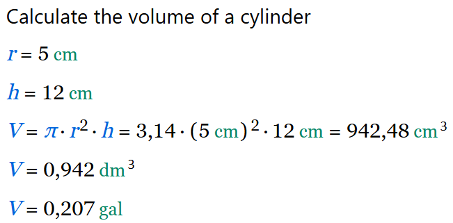

<div align="center">


# CalcpadCE

**An open-source engineering worksheet editor with simple syntax and beautifully rendered output in real time.**

[](https://github.com/imartincei/CalcpadCE/actions)
[](https://github.com/imartincei/CalcpadCE/releases/latest)
[](https://opensource.org/licenses/MIT)
</div>

<br>

## 📖 What is CalcpadCE?

CalcpadCE is an open-source tool for mathematical and engineering calculations.
Write your formulas in a simple, readable syntax and get beautifully rendered output with plots, diagrams, and formatted results — all in real time.
For Desktop, Web and Visual Studio Code.

This is a fork of the now [closed-source](#️-project-status--history) Calcpad 7.6.2 (March 2026).

🡒 **[View the Documentation](https://imartincei.github.io/CalcpadCE/)**

**Core Features:**

* **Advanced Mathematics:** Native support for real and complex numbers, vectors, matrices, and a comprehensive library of numerical methods (integration, differentiation, root finding, FFT).
* **Smart Unit Tracking:** Built-in support for SI, Imperial, and USCS units, plus the ability to define custom units.
* **Programmability:** Full control over your calculations using custom functions, macros, conditional logic, loops, and file I/O (CSV / Excel ).
* **Rich Documentation:** Seamlessly embed Markdown, HTML, CSS, and parametric SVG drawings directly alongside your code.
* **Professional Reporting:** Automatically generate interactive HTML input forms and export polished, heavily formatted reports to native Word  formulas or PDF .


## 🚀 Downloads & Installation

You can download the latest version of the CalcpadCE desktop application directly from our GitHub Releases page.
We provide a standard Windows installer, portable executables, and Linux packages.

**VS Code Extension:**
If you prefer to write your worksheets in an IDE, we maintain a dedicated extension for Visual Studio Code providing syntax highlighting, snippets, and more.

🡒 **[Downloads](https://github.com/imartincei/CalcpadCE/releases/latest)**

🡒 **[Try the Online Editor](https://calcpad-ce.org/)**

## ⚡ Quick Start

Writing a CalcpadCE worksheet is as simple as typing math and adding comments.

### Code

```mathlab
' Calculate the volume of a cylinder
r = 5 cm
h = 12 cm
V = π * r^2 * h
V|dm^3
V|gal
```

### Output




## 🌐 Community & Resources

Whether you need help getting started or want to chat with other users, you can find us here:

* **[Official Website](https://calcpad-ce.org/)**
* **[Documentation](https://imartincei.github.io/CalcpadCE/)**
* **[Quick Reference](https://imartincei.github.io/CalcpadCE/quick-reference.html)**
* **[GitHub Discussions](https://github.com/imartincei/CalcpadCE/discussions)**
* **[Join our Discord Server](https://discord.gg/NMttSUhZss)**

## 🏛️ Project Status & History

Following a shift to a closed-source model by its original creator, the public GitHub repository for Calcpad was taken offline.

Our community stepped up to fork the project and continue its open-source development.
We restored the final open-source release to officially launch CalcpadCE as a free, community-driven continuation of the software.

Our goal is to ensure that a free, open-source version of this fantastic tool remains available, maintained, and continuously improved by the community.

## 🤝 Contributing

CalcpadCE is entirely maintained by volunteers, and we welcome contributions of all sizes!
Whether you want to fix a bug, add a new numerical method, or improve the documentation, we would love your help.

To get started, please check out the repository, build the project locally, and browse our open issues.
If you are planning a major feature, we recommend opening a Discussion first to coordinate with the maintainers.

🡒 **[Contribution Guidelines](CONTRIBUTING.md)**

## 🛠️ Building the Source Code

Download and install the [.NET 10 SDK](https://dotnet.microsoft.com/en-us/download/dotnet/10.0).

```shell
git clone https://github.com/imartincei/CalcpadCE.git
cd CalcpadCE
dotnet build Calcpad.Wpf
```

Run the application by starting the built EXE: `Calcpad.Wpf\bin\Debug\net10.0-windows\CalcpadCE.exe`.

## 📄 License & Credits

CalcpadCE is released under the **MIT License**.

This project builds upon the tremendous foundational work of the original Calcpad application.
Copyright (c) 2014-2026 Ned Ganchovski.
All subsequent modifications and additions are Copyright (c) 2026 CalcpadCE Contributors.

This project uses some additional third party components, software and design. They are re-distributed free of charge, under the license conditions, provided by the respective authors.

1. The new and beautiful icons are created using [icons8.com](https://icons8.com/).  
2. The pdf export was made possible thanks to the [wkhtmltopdf.org](https://wkhtmltopdf.org/) project.  
3. Some symbols are displayed, using the Jost* font family by [indestructible type*](https://indestructibletype.com/), under the [SIL open font license](https://scripts.sil.org/cms/scripts/page.php?item_id=OFL_web).
Square brackets are slightly modified to suit the application needs.
