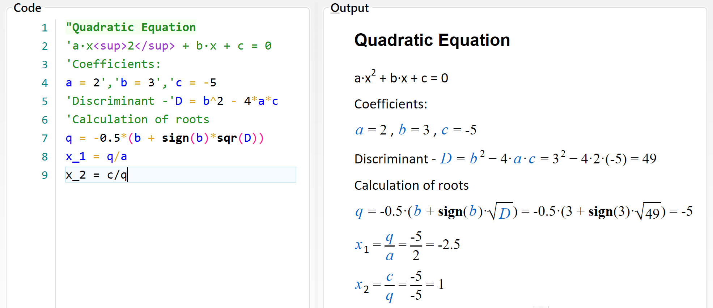

# Expressions

The main purpose of CalcpadCE is to perform calculations.
That is why, everything inside the input window is assumed to be mathematical expressions, unless it is enclosed in quotes.
Then it is treated as comments.
By default, each expression has to be in a separate line, e.g.:

```calcpad
2 + 3

5 * (3 + 1)

15 / 2
```

You must not add "=" at the end of each expression.
This is the assignment operator.
It is used to assign values to variables, e.g. "*a* = 2". Press the  button, to see the results in the output window:

`2 + 3` $= 5$

`5 * (3 + 1)` $= 20$

`15 / 2` $= 7.5$

Alternatively, you can have several expressions in a single line, but they must be separated by comments, e.g.:

```calcpad
'Length -'a = 3m', Width -'b = 2*a', Height -'c = 5m
```

On the other hand, if an expression is too long and complex, you can split it into several lines by adding line continuation operator " \_" at the end of each line.
You can split a line without adding " \_" always when it ends with an opening bracket: "{", "(", "\[" or delimiter: ";", "\|", "&", "@", ":" that is not inside a comment.

Each expression can include constants (numbers), variables, operators, functions and brackets.
They must be arranged properly in order to represent a valid expression.
The commonly accepted mathematical notation and operator precedence is used as it is taught in school.
Detailed description of the expression components is provided below.

You can calculate separate unrelated expressions like with simple calculator or write a complete program that solves a specific problem.
You can define variables and assign values to them.
Further, you can use them to define other variables and so on until you reach the final result.
You can also add text, Html and images to create detailed and professional-looking calculation report.
You can save it to a file and use it multiple times to solve similar problems.
Below, you can see a sample program for solving a quadratic equation:


