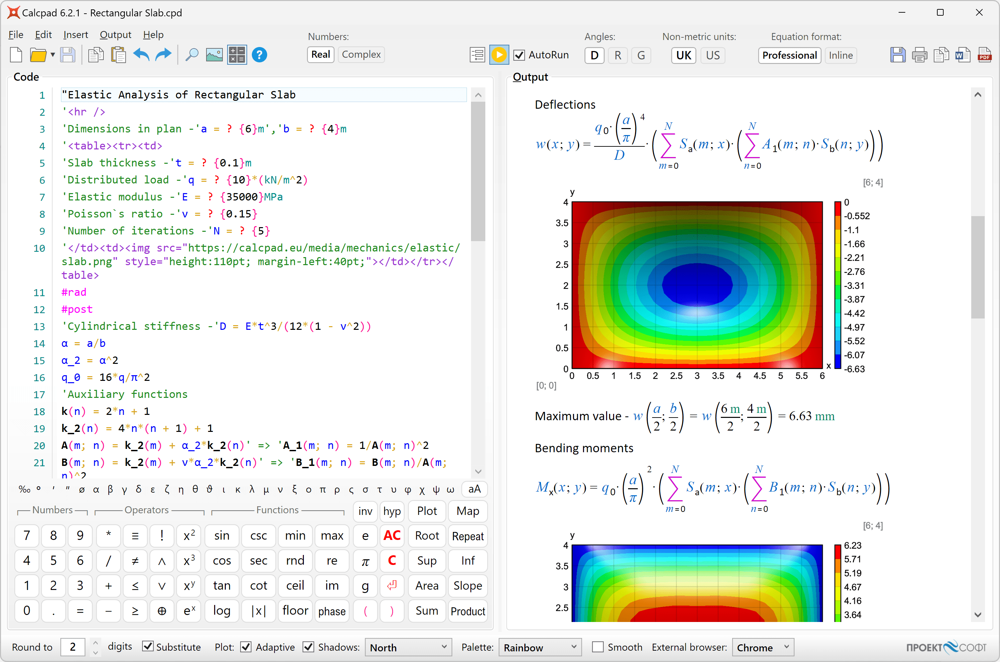

# About CalcpadCE

CalcpadCE (Community Edition) is free and open-source software for mathematical and engineering calculations.
It combines powerful computational algorithms with Html formatted reporting with export to Word.
It is simple and easy to use, but it also includes many advanced features:

- real and complex numbers (rectangular and polar-phasor formats);
- units of measurement (SI, Imperial and USCS);
- vectors and matrices: rectangular, symmetric, column, diagonal, upper/lower triangular;
- custom variables and units;
- built-in library with common math functions;
- vectors and matrix functions:
  - data functions: search, lookup, sort, count, etc.;
  - aggregate functions: min, max, sum, sumsq, srss, average, product, (geometric) mean, etc.;
  - math functions: norm, condition, determinant, rank, trace, transpose, adjugate and cofactor, inverse, factorization (Cholesky, ldlt, lu, qr and svd), eigenvalues/vectors and linear systems of equations;
- custom functions of multiple parameters f(x; y; z; …);
- powerful numerical methods for root and extremum finding, numerical integration and differentiation;
- finite sum, product and iteration procedures, Fourier series and FFT;
- modules, macros and string variables;
- reading and writing data from/to text, CSV and Excel files;
- program flow control with conditions and loops;
- "titles" and 'text' comments in quotes;
- support for Html, CSS and Markdown in comments for rich formatting;
- function plotting, images, tables, parametric SVG drawings, etc.;
- automatic generation of Html forms for data input;
- professional looking Html reports for viewing and printing;
- export to Word (\*.docx) and PDF documents;
- variable substitution and smart rounding of numbers;
- output visibility control and content folding;
- support for plain text (\*.txt, \*.cpd) and binary (\*.cpdz) file formats.

This software is developed using the C# programming language.
It automatically parses the input, substitutes the variables, calculates the expressions and displays the output.
All results are sent to a professional looking Html report for viewing and printing.

