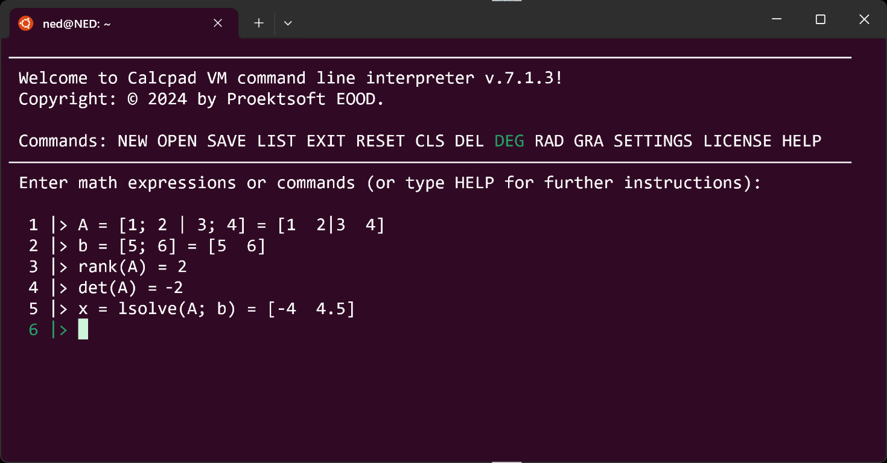
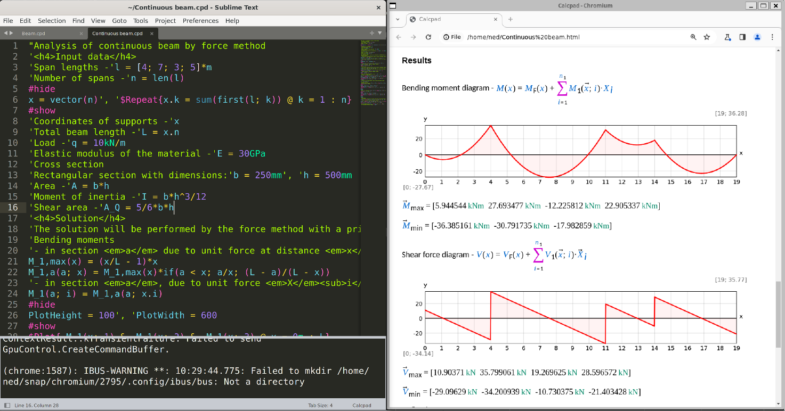

# Installation

## Windows

Installation is performed by the automated [setup program](https://github.com/imartincei/CalcpadCE/releases). Follow the instruction of the setup wizard.
The software requires a 64-bit computer with Windows 10/11 and [Microsoft .NET Desktop Runtime 10.0](https://dotnet.microsoft.com/en-us/download/dotnet/10.0).

The installer also includes the command-line interface (CLI).
After installation it can be found at:
`%LOCALAPPDATA%\Programs\CalcpadCE\cli\Cli.exe`

## Linux

1. CalcpadCE is a .NET application, so you need .NET 10.0 to run it on Linux.
    Use the following commands to install .NET 10.0 runtime:

    ```bash
    sudo apt update

    sudo apt-get install -y dotnet-runtime-10.0
    ```

    If you need to uninstall older dotnet versions, run this command before the above ones:

    ```bash
    sudo apt remove dotnet*
    ```

2. If you do not have Chromium installed, you will need it to download CalcpadCE and view the reports after calculation.
    Install it with the following command:

    ```bash
    sudo snap install chromium
    ```

3. Download the CalcpadCE setup package from the following link: <https://github.com/imartincei/CalcpadCE/releases>
    Then, install CalcpadCE, using the following command:

    ```bash
    sudo apt-get install -y <path-to-your-downloads-folder>/Calcpad.7.5.9.deb
    ```

    Instead of <path-to-your-downloads-folder\> you must put the actual path, something like this:

    ```bash
    sudo apt-get install -y /home/<user>/snap/chromium/3235/Downloads/Calcpad.7.5.9.deb
    ```

    If you get a message like the one below, please ignore it: N: Download is performed unsandboxed as root as file '.../Calcpad.7.5.9.deb' couldn't be accessed by user '\_apt'. - pkgAcquire::Run (13: Permission denied)

And that's it.
You can start the CalcpadCE command line interpreter (CLI) by simply typing:

```bash
calcpad
```

You can use it to perform calculations in console mode:



The Linux version does not include any GUI yet, but you can use some advanced code editors like Notepad++ and Sublime to write CalcpadCE code and Chromium to view the results.
Instructions on how to install Sublime Text on Linux are provided here: 

<https://www.sublimetext.com/docs/linux_repositories.html>

For Ubuntu, you can use the following commands:

```bash
wget -qO - https://download.sublimetext.com/sublimehq-pub.gpg | gpg --dearmor | sudo tee /etc/apt/trusted.gpg.d/sublimehq-archive.gpg > /dev/null

sudo apt-get update

echo "deb https://download.sublimetext.com/ apt/stable/" | sudo tee /etc/apt/sources.list.d/sublime-text.list

sudo apt-get install sublime-text
```

Then, goto <https://github.com/imartincei/CalcpadCE/tree/main/Setup/Linux/Sublime> and download the following files:

- calcpad.sublime-build  
- calcpad.sublime-completions  
- calcpad.sublime-syntax  
- Monokai.sublime-color-scheme

Copy them to the Sublime Text user package folder:

/home/<user\>/.config/sublime-text/Packages/User

Here, <user\> must be your actual username.
Finally, you can open Sublime Text and Chromium with the following commands:

```text
subl &
chromium &
```

Put them side to side.
Start a new \*.cpd file in Sublime Text or open an example from the /usr/share/CalcpadCE/Examples folder.
Press Ctrl+B to calculate.
If everything is OK, the results will show in Chromium:



Finally, if you want to uninstall Calcpad, type the following:

```bash
sudo apt-get --purge remove calcpad
```
