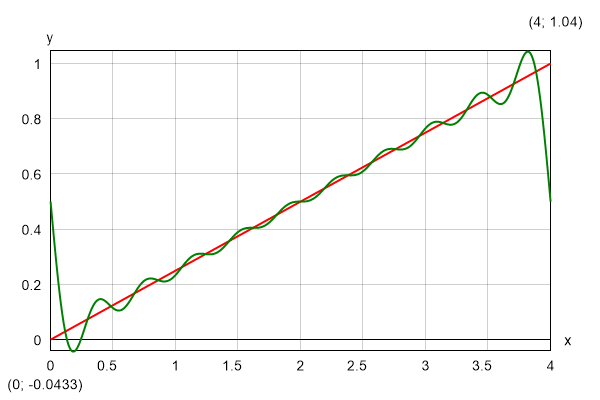
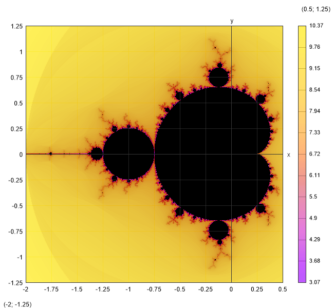
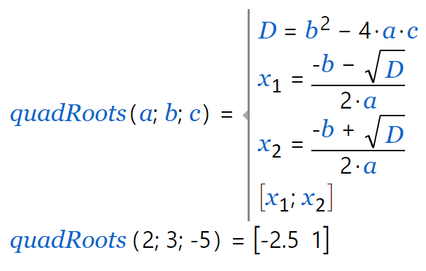

# Iterative procedures

There are some other commands that allow you to calculate the result iteratively.
Unlike numerical methods, they can work with complex numbers.

## Sum

```matlab
$Sum{f(k) @ k = a : b}
```

It sums the values of f(*k*) for all integer *k* between *a* and *b*. The values of *k* can only grow, so it should be satisfied that *a* \< *b*. Instead of f(*k*) you can put any valid expression that includes *k*. Otherwise, it will simply sum the same value *k* times.
For example, you can use series to calculate constants.
Such is the Leibniz formula for calculation of π:

```matlab
4 * $Sum{(-1)^(k+1)/(2*k - 1) @ k = 1:1000}` $= 3.1406$
```

You can also use series to define functions.
Of course, they cannot be infinite.
The number of iterations should be sufficient to provide the required precision of the result.
The following pattern can be applied to approximate a function with Fourier series:

```matlab
f(x) = a_0/2 + $Sum{a(k)*cos(k*x*π/l) @ k=1:n} + $Sum{b(k)*sin(k*x*π*l) @ k=1:n}
```

As an example, we can take a straight line within the interval (0; 2\**l*), withs equation: f(*x*) = *x*/(2\**l*). The integration constants are *a*(*k*) = 0 and *b*(*k*) = -1/(*k*\*π). If we plot the Fourier approximation for *n* = 5, we will get the following result:



## Product

```matlab
$Product{f(k) @ k = a : b}
```

It works like "**Sum**", but it multiplies the terms instead of adding them.
For example, you can define your own factorial function:

```matlab
F(n) = $Product{k @ k = 1 : n}
```

You can use it further to calculate binomial coefficients by the well-known formula: C(*n*; *k*) = F(*n*)/(F (*k*)\*F(*n* - *k*)). However, it is much more efficient to define a special procedure that computes the coefficient directly without using factorials:

```matlab
$Product{(i + n - k)/i @ i = 1:k}
```

Also, the latter will not overflow together with the factorials for greater values of *n*.

## Repeat

```matlab
$Repeat{f(k) @ k = a : b}
```

This is a general inline iterative procedure that repeatedly calculates **f**(*k*). It can be used for sums and products instead of the respective procedures, but it is not so efficient.
However, there are expressions that can be calculated only by the "**Repeat**" command.
Normally, such expressions will make sense if you assign the result to a variable to be used in the next iteration.
So, the following pattern is more likely to be applied in practice:

```matlab
$Repeat{x = f(x; k) @ k = a : b}
```

For example, you can use this command to define the Mandelbrot set in a single line:

```matlab
f(z; c) = $Repeat{z = z^2 + c @ i = 1:100}
```

You should not forget to switch to "Complex" mode.
Then you can plot the result:

```matlab
$Map{abs(f(0; x + 1i*y)) @ x = -1.5:0.5 & y = -1:1}
```



## Expression blocks

An expression block encloses a list of expressions, divided by semicolons.
All expressions can assign to local variables.
You can use expression blocks to embed short algorithmic procedures into function definitions, inline loops or any other expressions and expression blocks.
There are two types of expression blocks that differ only in the way they are rendered in the output:

- `$Block{expr1; expr2; expr3; ...}` multiline block of expressions;
- `$Inline{expr1; expr2; expr3; ...}` inline block of expressions.

As the respective names imply, `$Block` is rendered on multiple lines, one for each expression, and for `$Inline` all expressions are rendered on a single line sequentially from left to right.

You can use expression blocks to create multiline functions when a single expression is not sufficient to evaluate the result.
Such is the *quadRoots* function in the example below that find the roots of a quadratic equation by given coefficients *a*, *b*, *c* and returns them as a vector of two elements $[x_1; x_2]$.

<table style="width:91%;">
<colgroup>
<col style="width: 44%" />
<col style="width: 47%" />
</colgroup>
<thead>
<tr>
<th style="text-align: center;"><strong>Code</strong></th>
<th style="text-align: center;"><strong>Output</strong></th>
</tr>
</thead>
<tbody>
<tr>
<td style="text-align: left;">
```matlab
quadRoots(a; b; c) = _
$block{
    D = b^2 - 4*a*c;
    x_1 = (-b - sqrt(D))/(2*a);
    x_2 = (-b + sqrt(D))/(2*a);
    [x_1; x_2];
}
quadRoots(2; 3; -5)
```
</td>
<td></td>
</tr>
</tbody>
</table>

When you have a `$Repeat` inline loop you can nest multiple expressions directly inside without enclosing them with a `$block`/`$inline` element.
Alternatively, you can use a conditional “while“ loop:

`$While{condition; expr1; expr2; ...}` iterative expression block with condition.

All expressions inside a block or inline loop are compiled, so that they are executed very fast.
They are evaluated sequentially from left to right and only the last result is returned at the end.
However, unlike the standard expressions you cannot see intermediate results and substituted variables.
This reduces readability and verifiability of calculations.
So, expression blocks should be used only where they are actually needed.

Each variable created by the "**=**" operator inside a code block of type \$block, \$inline, \$while  
and \$repeat is local for this block and the nested ones, even if it already exists outside.
In this case, the existing variable will not be overwritten and will preserve its original value after the execution of the block.
All global and outer scope variables and functions are visible inside the current and inner blocks and accessible for reading.

In general, this is considered a good language design because there are no unpredictable side effects like accidentally changing some global variables just because the names are coincident.
However, in certain scenarios, we may need to update global variables deliberately, mostly inside loops.
For that purpose, you have to use a special operator "**←**". Unlike "**=**", it does not create a local variable.
Instead, it searches for the innermost existing variable in the current or outer scopes and updates its value.
If the variable does not exist, an error is reported.
