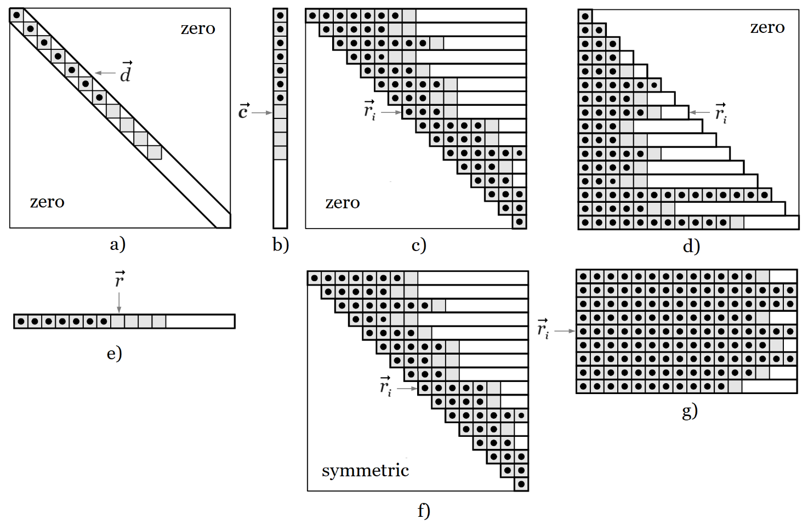

# Matrices

## Internal Implementation and Types of Matrices

CalcpadCE includes different types of matrices: general (rectangular) and special (column, symmetric, diagonal.
upper/lower triangular). Internally, each type is implemented in a different way that benefits from the specific structure for better efficiency.
Externally, all of them behave in a similar way, except for a few cases.

Each matrix type is implemented as an array of vectors, as displayed on the figure below.
Vectors normally represent matrix rows, except for diagonal and column matrices.



CalcpadCE uses large vectors to contain the values.
So, it does not store the extra zero elements for partially filled (banded) matrices.
The indexing operator for each type is internally redefined in order to return directly zero when we try to read a value outside the matrix structure or bandwidth.

| | |
| ---- | ---- |
| diagonal matrix | *M*\[*i*, *j*\] = *d*\[*i*\], if *i* = *j* and 0, if *i* ≠ *j*; |
| column matrix | *M*\[*i*, *j*\] = *c*\[*i*\], if *j* = 1, otherwise – error; |
| upper triangular matrix | *M*\[*i*, *j*\] = *r*i\[*j* – *i* + 1\], if *j* ≥ *i*, otherwise – 0; |
| lower triangular matrix | *M*\[*i*, *j*\] = *r*i\[*j*\], if *j* ≤ *i*, otherwise – 0; |
| row matrix | *M*\[*i*, *j*\] = *r*\[*j*\], if *i* = 1, otherwise – error; |
| symmetric matrix | *M*\[*i*, *j*\] = *r*i\[*j* – *i* + 1\], if *i* ≥ *j*, otherwise = *r*i \[*i* – *j* + 1\]; |
| rectangular matrix | *M*\[*i*, *j*\] = *r*i\[*j*\]; |

If we try to write a non-zero value outside the matrix structure, we will get an "Index out of range" error.
For example, you cannot assign a non-zero value to an element outside the main diagonal of a diagonal type of matrix.

## Definition

Similar to vectors, you can define matrices by using the "square brackets" syntax, but the rows must be separated by vertical bars " \| ", as follows:

```calcpad
A_m⨯n = [a_11; a_12; …; a_1n|a_21; a_22; …;a_2n|…| a_m1; a_m2; …; a_mn]`
```

In this way, you can create only general (rectangular) types of matrices.
For special types of matrices, you have to use the respective creational functions as described further in this manual.
If you have rows with different lengths, the number of columns *n* is assumed to be the maximum number of elements in a row.
The missing elements in other rows are assumed to be zero.
For example:

`A = [1|2; 3|4; 5; 6|7; 8]` $`= \begin{bmatrix}
1 & 0 & 0 \\
2 & 3 & 0 \\
4 & 5 & 6 \\
7 & 8 & 0
\end{bmatrix}`$

You can use expressions for matrix elements that contain variables, operators, functions, vectors, other matrices, etc.
For example, the following code will create a matrix of three rows by applying a different expression for each row on a single vector:

`a = [1; 2; 4]`  
`A = [a|2*a + 1|3*a + 2]` $`= \begin{bmatrix}
1 & 2 & 4 \\
5 & 5 & 9 \\
8 & 8 & 14
\end{bmatrix}`$

Just like vectors, matrices can also be defined as functions to create them dynamically on demand.
The following function generates a 4×4 Vandermonde matrix from a vector containing the elements for the first column:

`A(x) = transp([x^0|x|x^2|x^3|x^4])`  
`x = [1; 2; 3; 4]`  
`A = A(x)` $`= \begin{bmatrix}
1 & 1 & 1 & 1 & 1 \\
1 & 2 & 4 & 8 & 16 \\
1 & 3 & 9 & 27 & 81 \\
1 & 4 & 16 & 64 & 256
\end{bmatrix}`$

## Indexing

You can use indexing to access individual matrix elements for reading and writing their values.
Similar to vectors, this is performed by the dot operator, but you have to specify two indexes, as follows:

`A.(i; j)`, where:  
*i* - the index of the row where the element is located,  
*j* - the index of the column.

Indexes must be enclosed in brackets and divided by a semicolon.
Row and column numbering start from one.
For the Vandermonde matrix from the above example:

`A.(3; 2)` $= 3.$

You can have expressions inside the brackets to calculate the indexes in place:

`i = 2`, `j = 3`  
`A.(2*i - 1; j + 1)` $= A_{3, 4} = 27.$

In this way, you can iterate through matrix elements in a loop and include the loop counters in the respective indexes.
You can use both inline and block loops for that purpose.
The code below creates a Vandermonde matrix from vector $\vec{x}$ with the specified number of columns (6):

```calcpad
x = [1; 2; 3; 4]
A = matrix(len(x); 7)
#hide
#for i = 1 : n_rows(A)
  #for j = 1 : n_cols(A)
    A.(i; j) = x.i^(j - 1)
  #loop
#loop
#show
```

`A` $`= \begin{bmatrix}
1 & 1 & 1 & 1 & 1 & 1 & 1 \\
1 & 2 & 4 & 8 & 16 & 32 & 64 \\
1 & 3 & 9 & 27 & 81 & 243 & 729 \\
1 & 4 & 16 & 64 & 256 & 1024 & 4096
\end{bmatrix}`$

The inline equivalent of the above loop is the following:

```calcpad
$Repeat{$Repeat{A.(i; j) = x.i^(j - 1) @ j = 1 : n_cols(A)} @ i = 1 : n_rows(A)}
```

## Creational Functions

The "square brackets" syntax is very powerful and flexible for creating small matrices with predefined sizes.
However, it also has a lot of limitations.
For example, it cannot create special types of matrices and cannot specify the matrix dimensions.
That is why, CalcpadCE also includes various functions for creating matrices, as follows:

### **matrix**(*m*; *n*)

**Parameters**:

*m*
:   (positive integer) number of rows

*n*
:   (positive integer) number of columns

**Return value**:
:   an empty rectangular matrix with dimensions m⨯n.

!!! note
    *m* and *n* must be between 1 and 1 000 000.
    This also applies to all other kinds of matrices below.

!!! example
    `matrix(3; 4)` $`= \begin{bmatrix}
    0 & 0 & 0 & 0 \\
    0 & 0 & 0 & 0 \\
    0 & 0 & 0 & 0
    \end{bmatrix}`$

### **identity**(*n*)

**Parameters**:

*n*
:   number of rows/columns

**Return value**:
:   an identity matrix with dimensions n⨯n.

!!! note
    Represents a diagonal matrix, filled with one along the main diagonal. This function is equivalent to **diagonal**(*n* ; 1).

!!! example
    `identity(3)` $`= \begin{bmatrix}
    1 & 0 & 0 \\
    0 & 1 & 0 \\
    0 & 0 & 1
    \end{bmatrix}`$

### **diagonal**(*n*; *d*)

**Parameters**:

*n*
:   number of rows/columns

*d*
:   the value along the main diagonal

**Return value**:
:   an n⨯n diagonal matrix, filled with value *d* along the main diagonal.

!!! note
    It is internally different and more efficient than an n⨯n symmetric matrix.

!!! example
    `diagonal(3; 2)` $`= \begin{bmatrix}
    2 & 0 & 0 \\
    0 & 2 & 0 \\
    0 & 0 & 2
    \end{bmatrix}`$

### **column**(*m*; *c*)

**Parameters**:

*m*
:   number of rows

*c*
:   a value to fill the matrix with

**Return value**:
:   an m⨯1 column matrix, filled with value *c*.

!!! note
    It is internally different and more efficient than an mx1 rectangular matrix.

!!! example
    `column(3; 2)` $`= \begin{bmatrix}
    2 \\
    2 \\
    2
    \end{bmatrix}`$

### **utriang**(*n*)

**Parameters**:

*n*
:   number of rows/columns

**Return value**:
:   an empty upper triangular matrix with dimensions n⨯n.

!!! note
    It is internally different and more efficient than a general n⨯n matrix.

!!! example
    `U = utriang(3)`  
    `mfill(U; 1)` $`= \begin{bmatrix}
    1 & 1 & 1 \\
    0 & 1 & 1 \\
    0 & 0 & 1
    \end{bmatrix}`$

### **ltriang**(*n*)

**Parameters**:

*n*
:   number of rows/columns

**Return value**:
:   an empty lower triangular matrix with dimensions n⨯n.

!!! note
    It is internally different and more efficient than general n⨯n matrix.

!!! example
    `L = ltriang(3)`  
    `mfill(L; 1)` $`= \begin{bmatrix}
    1 & 0 & 0 \\
    1 & 1 & 0 \\
    1 & 1 & 1
    \end{bmatrix}`$

### **symmetric**(*n*)

**Parameters**:

*n*
:   number of rows/columns

**Return value**:
:   an empty n⨯n symmetric matrix.

!!! note
    It is internally different and more efficient than general n⨯n matrix.
    Only the filled side of the upper-right half of the matrix is stored, forming a skyline structure.
    If you change a value on either of both sides also changes the respective value on the other side, keeping the matrix always symmetric.

!!! example
    `A = symmetric(4)`  
    `A.(1; 1) = 5`, `A.(1; 2) = 4`  
    `A.(2; 2) = 3`, `A.(2; 3) = 2`  
    `A.(4; 2) = 1`, `A.(4; 4) = 1`  
    `A` $`= \begin{bmatrix}
    5 & 4 & 0 & 0 \\
    4 & 3 & 2 & 1 \\
    0 & 2 & 0 & 0 \\
    0 & 1 & 0 & 1
    \end{bmatrix}`$

### **vec2diag**($\vec{v}$)

**Parameters**:

$\vec{v}$
:   a vector containing the diagonal elements

**Return value**:
:   a diagonal matrix from the elements of vector $\vec{v}$.

!!! note
    The size of the matrix is equal to the number of elements in $\vec{v}$.

!!! example
    `vec2diag([1; 2; 3])` $`= \begin{bmatrix}
    1 & 0 & 0 \\
    0 & 2 & 0 \\
    0 & 0 & 3
    \end{bmatrix}`$

### **vec2row**($\vec{v}$)

**Parameters**:

$\vec{v}$
:   a vector containing the elements of the row matrix

**Return value**:
:   a row matrix from the elements of vector $\vec{v}$.

!!! note
    The number of columns of the matrix is equal to the size of $\vec{v}$.

!!! example
    `vec2row([1; 2; 3])` $`= \begin{bmatrix}
    1 & 2 & 3
    \end{bmatrix}`$

### **vec2col**($\vec{v}$)

**Parameters**:

$\vec{v}$
:   a vector containing the elements of the column matrix

**Return value**:
:   a column matrix from the elements of vector $\vec{v}$.

!!! note
    The number of rows of the matrix is equal to the size of $\vec{v}$.

!!! example
    `vec2col([1; 2; 3])` $`= \begin{bmatrix}
    1 \\
    2 \\
    3
    \end{bmatrix}`$

### **join_cols**($\vec{c}_{1}$; $\vec{c}_{2}$; $\vec{c}_{3}$ ...)

**Parameters**:
:   $\vec{c}_{1}$, $\vec{c}_{2}$, $\vec{c}_{3}$ ... - vectors.

**Return value**:
:   a new rectangular matrix, obtained by joining the column vectors.

!!! note
    You can specify arbitrary number of input vectors with different lengths.
    The number of rows is equal to the maximum vector length and the other columns are filled down with zeros to the end.
    The vectors are joined sequentially from left to right.

!!! example
    `join_cols([1]; [4; 5; 6]; [7; 8]; [10; 11; 12])` $`= \begin{bmatrix}
    1 & 4 & 7 & 10 \\
    0 & 5 & 8 & 11 \\
    0 & 6 & 0 & 12
    \end{bmatrix}`$

### **join_rows**($\vec{r}_{1}$; $\vec{r}_{2}$; $\vec{r}_{3}$ ...)

**Parameters**:
:   $\vec{r}_{1}$, $\vec{r}_{2}$, $\vec{r}_{3}$ ... - vectors.

**Return value**:
:   a new rectangular matrix, which rows are the specified vector arguments.

!!! note
    You can have an arbitrary number of input vectors with different lengths. The number of columns is equal to the maximum vector length. The other rows are filled up with zeros to the end. The vectors are collected from left to right and arranged into rows from top to bottom.

!!! example
    `join_rows([1; 2; 3; 4]; [6; 7; 8; 9; 10])` $`= \begin{bmatrix}
    1 & 2 & 3 & 4 & 0 \\
    6 & 7 & 8 & 9 & 10
    \end{bmatrix}`$

### **augment**(*A*; *B*; *C* ...)

**Parameters**:
:   *A*, *B*, *C* ... - matrices.

**Return value**:
:   a rectangular matrix obtained by joining the input matrices side to side.

!!! note
    You can specify arbitrary number of input matrices with different number of rows.
    The largest number is relevant, and smaller matrices are filled down with zeros to the end.
    Matrices are joined sequentially from left to right.
    If the arguments contain vectors, they are treated as columns.

!!! example
    `A = [1; 2|3; 4]`  
    `B = [1; 2; 3|4; 5; 6|7; 8; 9]`  
    `c = [10; 11; 12; 13]`  
    `D = augment(A; B; c)` $`= \begin{bmatrix}
    1 & 2 & 1 & 2 & 3 & 10 \\
    3 & 4 & 4 & 5 & 6 & 11 \\
    0 & 0 & 7 & 8 & 9 & 12 \\
    0 & 0 & 0 & 0 & 0 & 13
    \end{bmatrix}`$

### **stack**(*A*; *B*; *C* ...)

**Parameters**:
:   *A*, *B*, *C* ... - matrices.

**Return value**:
:   a rectangular matrix, obtained by stacking the input matrices one below the other.

!!! note
    You can specify an arbitrary number of input matrices with different row lengths.
    The largest number is relevant, and smaller matrices are filled up with zeros to the end.
    Matrices are joined sequentially from top to bottom.
    If the arguments contain vectors, they are treated as columns.

!!! example
    `A = [1; 2|3; 4]`  
    `B = [1; 2; 3|4; 5; 6|7; 8; 9]`  
    `c = [10; 11]`  
    `D = stack(A; B; c)` $`= \begin{bmatrix}
    1 & 2 & 0 \\
    3 & 4 & 0 \\
    1 & 2 & 3 \\
    4 & 5 & 6 \\
    7 & 8 & 9 \\
    10 & 0 & 0 \\
    11 & 0 & 0
    \end{bmatrix}`$

## Structural Functions

Structural functions are related only to the matrix structure.
Unlike data and math functions, the result does not depend much on the values of the elements.

### **n_rows**(*M*)

**Parameters**:

*M*
:   matrix

**Return value**:
:   the number of rows in matrix *M*.

!!! example
    `n_rows([1; 2|3; 4|5; 6])` $= 3$

### **n_cols**(*M*)

**Parameters**:

*M*
:   matrix

**Return value**:
:   the number of columns in matrix *M*.

!!! example
    `n_cols([1|2; 3|4; 5; 6])` $= 3$

### **mresize**(*M*; *m*; *n*)

**Parameters**:

*M*
:   the matrix to be resized

*m*
:   the new number of rows

*n*
:   the new number of columns

**Return value**:
:   the matrix *M* resized to *m* rows and *n* columns.

!!! note
    If the new dimensions are larger, the added elements are initialized with zeroes.
    If smaller, the matrix is truncated.
    If the new dimensions are compatible to the matrix type, then the original matrix is resized in place and a reference to it is returned.
    Otherwise, a new rectangular type of matrix is returned with the specified dimensions and the original matrix remains unchanged.

!!! example
    `A = [1; 2; 3|4; 5; 6|7; 8; 9]` $`= \begin{bmatrix}
    1 & 2 & 3 \\
    4 & 5 & 6 \\
    7 & 8 & 9
    \end{bmatrix}`$ general type.  
    `B = mresize(A; 2; 4)` $`= \begin{bmatrix}
    1 & 2 & 3 & 0 \\
    4 & 5 & 6 & 0
    \end{bmatrix}`$ also a general type.  
    `A` $`= \begin{bmatrix}
    1 & 2 & 3 & 0 \\
    4 & 5 & 6 & 0
    \end{bmatrix}`$ the original matrix was changed.  
    `A = diagonal(3; 5)` $`= \begin{bmatrix}
    5 & 0 & 0 \\
    0 & 5 & 0 \\
    0 & 0 & 5
    \end{bmatrix}`$ diagonal type.  
    `B = mresize(A; 2; 4)` $`= \begin{bmatrix}
    5 & 0 & 0 & 0 \\
    0 & 5 & 0 & 0
    \end{bmatrix}`$ general type.  
    `A` $`= \begin{bmatrix}
    5 & 0 & 0 \\
    0 & 5 & 0 \\
    0 & 0 & 5
    \end{bmatrix}`$ the original matrix remains unchanged.

### **mfill**(*M*; *x*)

**Parameters**:

*M*
:   the matrix to be filled

*x*
:   the value to fill the matrix with

**Return value**:
:   the matrix *M* filled with value *x*.

!!! note
    The matrix *M* is modified in place and a reference to it is returned.
    This function is structurally compliant.
    Special matrices are filled only in the designated area, preserving the type.

!!! example
    `A = matrix(2; 3)` $`= \begin{bmatrix}
    0 & 0 & 0 \\
    0 & 0 & 0
    \end{bmatrix}`$  
    `B = mfill(A; 1)` $`= \begin{bmatrix}
    1 & 1 & 1 \\
    1 & 1 & 1
    \end{bmatrix}`$  
    `A` $`= \begin{bmatrix}
    1 & 1 & 1 \\
    1 & 1 & 1
    \end{bmatrix}`$  
    `L = mfill(ltriang(4); 2)` $`= \begin{bmatrix}
    2 & 0 & 0 & 0 \\
    2 & 2 & 0 & 0 \\
    2 & 2 & 2 & 0 \\
    2 & 2 & 2 & 2
    \end{bmatrix}`$

### **fill_row**(*M*; *i*; *x*)

**Parameters**:

*M*
:   the matrix which row is to be filled

*i*
:   the index of the row to be filled

*x*
:   the value to fill the row with

**Return value**:
:   the matrix *M* with the *i*-th row filled with value *x*.

!!! note
    The matrix *M* is modified in place and a reference to it is returned.
    This function is structurally compliant.
    Special matrices are filled only inside the designated area, preserving the type.

!!! example
    `A = matrix(3; 4)`  
    `fill_row(A; 2; 1)` $`= \begin{bmatrix}
    0 & 0 & 0 & 0 \\
    1 & 1 & 1 & 1 \\
    0 & 0 & 0 & 0
    \end{bmatrix}`$  
    `L = utriang(4)` upper triangular matrix;  
    `$Repeat{fill_row(L; k; k) @ k = 1 : n_rows(L)}`  
    `L` $`= \begin{bmatrix}
    1 & 1 & 1 & 1 \\
    0 & 2 & 2 & 2 \\
    0 & 0 & 3 & 3 \\
    0 & 0 & 0 & 4
    \end{bmatrix}`$ the lower triangle remains unchanged.

### **fill_col**(*M*; *j*; *x*)

**Parameters**:

*M*
:   the matrix which column is to be filled

*j*
:   the index of the column to be filled

*x*
:   the value to fill the column with

**Return value**:
:   the matrix *M* with the *j*-th column filled with value *x*.

!!! note
    The matrix *M* is modified in place and a reference to it is returned.
    This function is structurally compliant.
    Special matrices are filled only inside the designated area, preserving the type.

!!! example
    `A = matrix(3; 4)`  
    `fill_col(A; 2; 1)` $`= \begin{bmatrix}
    0 & 1 & 0 & 0 \\
    0 & 1 & 0 & 0 \\
    0 & 1 & 0 & 0
    \end{bmatrix}`$  
    `B = symmetric(4)` - symmetric matrix.  
    `fill_col(B; 2; 1)` $`= \begin{bmatrix}
    0 & 0 & 0 & 0 \\
    0 & 1 & 1 & 1 \\
    0 & 1 & 0 & 0 \\
    0 & 1 & 0 & 0
    \end{bmatrix}`$ the symmetry was preserved.

### **copy**(*A*; *B*; *i*; *j*)

**Parameters**:

*A*
:   source matrix

*B*
:   destination matrix where the elements will be copied

*i*
:   starting row index in matrix *B*

*j*
:   starting column index in matrix *B*

**Return value**:
:   the matrix *B*, after the elements from *A* are copied, starting at indexes *i* and *j* in *B*.

!!! note
    Copying the elements from *A* to *B* modifies the matrix *B* in place.
    The existing elements in *B* are replaced by the respective elements from *A*.
    A reference to *B* is returned as result.

!!! example
    `A = [1; 2; 3|4; 5; 6]`  
    `B = mfill(matrix(3; 4); -1)` $`= \begin{bmatrix}
     -1 & -1 & -1 & -1 \\
     -1 & -1 & -1 & -1 \\
     -1 & -1 & -1 & -1
    \end{bmatrix}`$  
    `copy(A; B; 1; 1)`  
    `copy(A; B; 2; 2)`  
    `B` $`= \begin{bmatrix}
    1 & 2 & 3 & -1 \\
    4 & 1 & 2 & 3 \\
     -1 & 4 & 5 & 6
    \end{bmatrix}`$

### **add**(*A*; *B*; *i*; *j*)

**Parameters**:

*A*
:   source matrix

*B*
:   destination matrix where the elements will be added

*i*
:   starting row index in matrix *B*

*j*
:   starting column index in matrix *B*

**Return value**:
:   the matrix *B* with the added elements from *A* to the respective elements in *B* starting at indexes *i* and *j* in *B*.

!!! note
    Adding the elements from *A* to *B* modifies the matrix *B* in place.
    A reference to *B* is returned as result.

!!! example
    `A = [1; 2; 3|4; 5; 6]`  
    `B = mfill(matrix(3; 4); -1)` $`= \begin{bmatrix}
     -1 & -1 & -1 & -1 \\
     -1 & -1 & -1 & -1 \\
     -1 & -1 & -1 & -1
    \end{bmatrix}`$  
    `add(A; B; 1; 1)`  
    `add(A; B; 2; 2)`  
    `B` $`= \begin{bmatrix}
    0 & 1 & 2 & -1 \\
    3 & 5 & 7 & 2 \\
     -1 & 3 & 4 & 5
    \end{bmatrix}`$

### **row**(*M*; *i*)

**Parameters**:

*M*
:   matrix

*i*
:   the index of the row to be extracted

**Return value**:
:   the *i*-th row of matrix *M* as a vector.

!!! note
    The full width row is returned, even for special matrices.

!!! example
    `A = [1; 2; 3|4; 5; 6|7; 8; 9]` $`= \begin{bmatrix}
    1 & 2 & 3 \\
    4 & 5 & 6 \\
    7 & 8 & 9
    \end{bmatrix}`$  
    `row(A; 3)` $= [7\ 8\ 9]$

### **col**(*M*; *j*)

**Parameters**:

*M*
:   matrix

*j*
:   the index of the column to be extracted

**Return value**:
:   the *j*-th column of matrix *M* as a vector.

!!! note
    The full height column is returned, even for special matrices.

!!! example
    `A = [1; 2; 3|4; 5; 6|7; 8; 9]` $`= \begin{bmatrix}
    1 & 2 & 3 \\
    4 & 5 & 6 \\
    7 & 8 & 9
    \end{bmatrix}`$  
    `col(A; 2)` $= [2\ 5\ 8]$

### **extract_rows**(*M*; $\vec{i}$)

**Parameters**:

*M*
:   matrix

$\vec{i}$
:   vector containing the indexes of the rows to be extracted

**Return value**:
:   a new matrix containing the rows of matrix *M* whose indexes are in vector $\vec{i}$.

!!! note
    The rows are extracted in the order, specified in vector $\vec{i}$. It can be a result from the **order_rows** function.

!!! example
    `A = [1; 2; 3|4; 5; 6|7; 8; 9]` $`= \begin{bmatrix}
    1 & 2 & 3 \\
    4 & 5 & 6 \\
    7 & 8 & 9
    \end{bmatrix}`$  
    `extract_rows(A; [1; 2; 1])` $`= \begin{bmatrix}
    1 & 2 & 3 \\
    4 & 5 & 6 \\
    1 & 2 & 3
    \end{bmatrix}`$

### **extract_cols**(*M*; $\vec{j}$)

**Parameters**:

*M*
:   matrix

$\vec{j}$
:   vector containing the indexes of the columns to be extracted

**Return value**:
:   a new matrix containing the columns of *M* whose indexes are in vector $\vec{j}$.

!!! note
    The columns are extracted in the order, specified in vector $\vec{j}$.
    It can be a result from the **order_cols** function.

!!! example
    `A = [1; 2; 3|4; 5; 6|7; 8; 9]` $`= \begin{bmatrix}
    1 & 2 & 3 \\
    4 & 5 & 6 \\
    7 & 8 & 9
    \end{bmatrix}`$  
    `extract_cols(A; [3; 2; 1])` $`= \begin{bmatrix}
    3 & 2 & 1 \\
    6 & 5 & 4 \\
    9 & 8 & 7
    \end{bmatrix}`$

### **diag2vec**(*M*)

**Parameters**:

*M*
:   matrix

**Return value**:
:   a vector containing the diagonal elements of *M*.

!!! note
    The matrix *M* is not required to be square.

!!! example
    `A = [1; 2|3; 4|5; 6; 7|8; 9; 10]` $`= \begin{bmatrix}
    1 & 2 & 0 \\
    3 & 4 & 0 \\
    5 & 6 & 7 \\
    8 & 9 & 10
    \end{bmatrix}`$  
    `diag2vec(A)` $= [1\ 4\ 7]$

### **submatrix**(M; $i_1$; $i_2$; $j_1$; $j_2$)

**Parameters**:

*M*
:   matrix

$i_1$
:   starting row index

$i_2$
:   ending row index

$j_1$
:   starting column index

$j_2$
:   ending column index

**Return value**:
:   a new matrix containing the submatrix of $M$ bounded by rows $i_1$ to $i_2$ and columns $j_1$ to $j_2$, inclusive.

!!! note
    Starting indexes can be greater than ending indexes.
    However, the same part of the matrix is returned.
    The result is always a general (rectangular) type of matrix, even if the source matrix is special.

!!! example
    ```
    A = [1;  2;  3; 4 | _
         5;  6;  7; 8 | _
         9; 10; 11; 12| _
        13; 14; 15; 16]
    ```
    `submatrix(A; 2; 3; 2; 4)` $`= \begin{bmatrix}
    6 & 7 & 8 \\
    10 & 11 & 12
    \end{bmatrix}`$

## Data Functions

Data functions are not related to the structure of matrices but to the values of the elements.
The following functions are available for use:

### **sort_cols**(*M*; *i*) / **rsort_cols**(*M*; *i*)

**Parameters**:

*M*
:   the matrix to be sorted

*i*
:   the index of the row on which the sorting will be based

**Return value**:
:   a new matrix with the columns of *M*, sorted by the values in row *i*.

!!! note
    **sort_cols** sorts in ascending order, and **rsort_cols** - in descending order.
    The original matrix is not modified.

!!! example
    `A = [5; 2; 3|4; 9; 1|6; 8; 7]` $`= \begin{bmatrix}
    5 & 2 & 3 \\
    4 & 9 & 1 \\
    6 & 8 & 7
    \end{bmatrix}`$  
    `B = sort_cols(A; 2)` $`= \begin{bmatrix}
    3 & 5 & 2 \\
    1 & 4 & 9 \\
    7 & 6 & 8
    \end{bmatrix}`$  
    `C = rsort_cols(A; 2)` $`= \begin{bmatrix}
    2 & 5 & 3 \\
    9 & 4 & 1 \\
    8 & 6 & 7
    \end{bmatrix}`$  
    `A` $`= \begin{bmatrix}
    5 & 2 & 3 \\
    4 & 9 & 1 \\
    6 & 8 & 7
    \end{bmatrix}`$ the original matrix is unchanged.

### **sort_rows**(*M*; *j*) / **rsort_rows**(*M*; *j*)

**Parameters**:

*M*
:   the matrix to be sorted

*j*
:   the index of the column on which the sorting will be based

**Return value**:
:   a new matrix with the rows of *M*, sorted by values in column *j*.

!!! note
    **sort_rows** sorts in ascending order, and **rsort_rows** sorts in descending order.
    The original matrix is not modified.

!!! example
    `A = [5; 2; 3|4; 9; 1|6; 8; 7]` $`= \begin{bmatrix}
    5 & 2 & 3 \\
    4 & 9 & 1 \\
    6 & 8 & 7
    \end{bmatrix}`$  
    `B = sort_rows(A; 2)` $`= \begin{bmatrix}
    5 & 2 & 3 \\
    6 & 8 & 7 \\
    4 & 9 & 1
    \end{bmatrix}`$  
    `C = rsort_rows(A; 2)` $`= \begin{bmatrix}
    4 & 9 & 1 \\
    6 & 8 & 7 \\
    5 & 2 & 3
    \end{bmatrix}`$  
    `A` $`= \begin{bmatrix}
    5 & 2 & 3 \\
    4 & 9 & 1 \\
    6 & 8 & 7
    \end{bmatrix}`$ the original matrix is unchanged.

### **order_cols**(*M*; *i*) / **revorder_cols**(*M*; *i*)

**Parameters**:

*M*
:   the matrix to be ordered

*i*
:   the index of the row on which the ordering will be based

**Return value**:
:   a vector containing the indexes of the columns of matrix *M* ordered by the values in row *i*.

!!! note
    **order_cols** returns the indexes in ascending order, and **revorder_cols** - in descending order.
    The matrix is not modified.
    Each index in the output vector $\vec{j}$ shows which column in *M* should be placed at the current position to obtain a sorted sequence in row *i*.
    You can get the sorted matrix by calling **extract_cols**(*M*; $\vec{j}$).

!!! example
    `A = [5; 2; 3|4; 9; 1|6; 8; 7]` $`= \begin{bmatrix}
    5 & 2 & 3 \\
    4 & 9 & 1 \\
    6 & 8 & 7
    \end{bmatrix}`$  
    `b = order_cols(A; 2)` $= [3\ 1\ 2]$  
    `B = extract_cols(A; b)` $`= \begin{bmatrix}
    3 & 5 & 2 \\
    1 & 4 & 9 \\
    7 & 6 & 8
    \end{bmatrix}`$  
    `c = revorder_cols(A; 2)` $= [2\ 1\ 3]$  
    `C = extract_cols(A; c)` $`= \begin{bmatrix}
    2 & 5 & 3 \\
    9 & 4 & 1 \\
    8 & 6 & 7
    \end{bmatrix}`$

### **order_rows**(*M*; *j*) / **revorder_rows**(*M*; *j*)

**Parameters**:

*M*
:   the matrix to be ordered

*j*
:   the index of the column on which the ordering will be based

**Return value**:
:   a vector containing the indexes of the rows of matrix *M* ordered by the values in column *j*.

!!! note
    **order_rows** returns the indexes in ascending order, and **revorder_rows** - in descending order.
    The matrix is not modified.
    Each index in the output vector $\vec{i}$ shows which row in *M* should be placed at the current position to obtain a sorted sequence in column *j*.
    You can get the sorted matrix by calling **extract_rows**(*M*; $\vec{i}$).

!!! example
    `A = [5; 2; 3|4; 9; 1|6; 8; 7]` $`= \begin{bmatrix}
    5 & 2 & 3 \\
    4 & 9 & 1 \\
    6 & 8 & 7
    \end{bmatrix}`$  
    `b = order_rows(A; 2)` $= [1\ 3\ 2]$  
    `B = extract_rows(A; b)` $`= \begin{bmatrix}
    5 & 2 & 3 \\
    6 & 8 & 7 \\
    4 & 9 & 1
    \end{bmatrix}`$  
    `c = revorder_rows(A; 2)` $= [2\ 3\ 1]$  
    `B = extract_rows(A; c)` $`= \begin{bmatrix}
    4 & 9 & 1 \\
    6 & 8 & 7 \\
    5 & 2 & 3
    \end{bmatrix}`$

### **mcount**(*M*; *x*)

**Parameters**:

*M*
:   matrix

*x*
:   the value to count the occurrences of

**Return value**:
:   the number of occurrences of value *x* in matrix *M*.

!!! example
    `A = [1; 0; 1|2; 1; 2|1; 3; 1]` $`= \begin{bmatrix}
    1 & 0 & 1 \\
    2 & 1 & 2 \\
    1 & 3 & 1
    \end{bmatrix}`$  
    `n = mcount(A; 1)` $= 5$

### **msearch**(*M*; *x*; *i*; *j*)

**Parameters**:

*M*
:   matrix

*x*
:   the value to search for

*i*
:   starting row index

*j*
:   starting column index

**Return value**:
:   a vector containing the row and column indexes of the first occurrence of *x* in matrix *M* after indexes *i* and *j*, inclusive.

!!! note
    The searching is performed row by row, consecutively from left to right.
    If nothing is found, $[0\ 0]$ is returned as result.

!!! example
    `A = [1; 2; 3|1; 5; 6|1; 8; 9]` $`= \begin{bmatrix}
    1 & 2 & 3 \\
    1 & 5 & 6 \\
    1 & 8 & 9
    \end{bmatrix}`$  
    `b = msearch(A; 1; 1; 1)` $= [1\ 1]$  
    `c = msearch(A; 1; 2; 2)` $= [3\ 1]$  
    `d = msearch(A; 4; 1; 1)` $= [0\ 0]$

### **mfind**(*M*; *x*)

**Parameters**:

*M*
:   matrix

*x*
:   the value to search for

**Return value**:
:   a two-row matrix containing the indexes of all elements in matrix *M* that are equal to *x*.

!!! note
    The top row in the result contains the row indexes, and the bottom row - the respective column indexes of the elements in *M* equal to *x*. If nothing is found, a 2×1 matrix with zeros is returned.

!!! example
    `A = [1; 2; 3|4; 1; 6|1; 8; 9]` $`= \begin{bmatrix}
    1 & 2 & 3 \\
    4 & 1 & 6 \\
    1 & 8 & 9
    \end{bmatrix}`$  
    `B = mfind(A; 1)` $`= \begin{bmatrix}
    1 & 2 & 3 \\
    1 & 2 & 1
    \end{bmatrix}`$  
    `C = mfind(A; 5)` $`= \begin{bmatrix}
    0 \\
    0
    \end{bmatrix}`$

### **hlookup**(*M*; *x*; $i_1$; $i_2$)

**Parameters**:

*M*
:   the matrix in which to perform the lookup

*x*
:   the value to look for

$i_1$
:   the index of the row where to search for value *x*

$i_2$
:   the index of the row from which to return the corresponding values

**Return value**:
:   a vector containing the values from row $i_2$ of matrix *M* for which the respective elements in row $i_1$ are equal to *x*.

!!! note
    The values are collected consequently from left to right.
    If nothing is found, an empty vector $[]$ is returned.

!!! example
    `A = [0; 1; 0; 1|1; 2; 3; 4; 5|6; 7; 8; 9; 10]` $`= \begin{bmatrix}
    0 & 1 & 0 & 1 & 0 \\
    1 & 2 & 3 & 4 & 5 \\
    6 & 7 & 8 & 9 & 10
    \end{bmatrix}`$  
    `b = hlookup(A; 0; 1; 3)` $= [6\ 8\ 10]$  
    `c = hlookup(A; 2; 1; 3)` $= []$

### **vlookup**(*M*; *x*; $j_1$; $j_2$)

**Parameters**:

*M*
:   the matrix in which to perform the lookup

*x*
:   the value to look for

$j_1$
:   the index of the column where to search for value *x*

$j_2$
:   the index of the column from which to return the values

**Return value**:
:   a vector containing the values from column $j_2$ of matrix *M* for which the respective elements in column $j_1$ are equal to *x*.

!!! note
    The values are collected consequently from top to bottom. If nothing is found, an empty vector $[]$ is returned.

!!! example
    `A = [1; 2|3; 4; 1|5; 6|7; 8; 1|9; 10]` $`= \begin{bmatrix}
    1 & 2 & 0 \\
    3 & 4 & 1 \\
    5 & 6 & 0 \\
    7 & 8 & 1 \\
    9 & 10 & 0
    \end{bmatrix}`$  
    `b = vlookup(A; 0; 3; 1)` $= [1\ 5\ 9]$  
    `c = vlookup(A; 1; 3; 2)` $= [4\ 8]$  
    `d = vlookup(A; 2; 3; 1)` $= []$

The **mfind**, **hlookup** and **vlookup** functions have variations with suffixes.
Different suffixes refer to different comparison operators.
They replace the equality in the original functions while the rest of the behavior remains unchanged.
The possible suffixes are given in the table below:

| suffix | mfind | hlookup | vlookup | operator |
|--------|-------|---------|---------|---------------------|
| \_eq | **mfind_eq**(*M*; *x*) | **hlookup_eq**(*M*; *x*; $i_1$; $i_2$) | **vlookup_eq**(*M*; *x*; $i_1$; $i_2$) | = - equal |
| \_ne | **mfind_ne**(*M*; *x*) | **hlookup_ne**(*M*; *x*; $i_1$; $i_2$) | **vlookup_ne**(*M*; *x*; $i_1$; $i_2$) | ≠ - not equal |
| \_lt | **mfind_lt**(*M*; *x*) | **hlookup_lt**(*M*; *x*; $i_1$; $i_2$) | **vlookup_lt**(*M*; *x*; $i_1$; $i_2$) | < - less than |
| \_le | **mfind_le**(*M*; *x*) | **hlookup_le**(*M*; *x*; $i_1$; $i_2$) | **vlookup_le**(*M*; *x*; $i_1$; $i_2$) | ≤ - less than<br />or equal |
| \_gt | **mfind_gt**(*M*; *x*) | **hlookup_gt**(*M*; *x*; $i_1$; $i_2$) | **vlookup_gt**(*M*; *x*; $i_1$; $i_2$) | > - greater than |
| \_ge | **mfind_ge**(*M*; *x*) | **hlookup_ge**(*M*; *x*; $i_1$; $i_2$) | **vlookup_ge**(*M*; *x*; $i_1$; $i_2$) | ≥ - greater than<br />or equal |

## Math Functions

All standard scalar math functions accept matrix arguments as well.
The function is applied separately to all the elements in the input matrix, even if it is of a special type.
The results are returned in a corresponding output matrix.
It is always a general (rectangular) type, so the structure is not preserved.
For example:

`#rad`  
`M = diagonal(3; π/2)` $`= \begin{bmatrix}
1.571 & 0 & 0 \\
0 & 1.571 & 0 \\
0 & 0 & 1.571
\end{bmatrix}`$  
`cos(M)` $`= \begin{bmatrix}
0 & 1 & 1 \\
1 & 0 & 1 \\
1 & 1 & 0
\end{bmatrix}`$

CalcpadCE also includes a lot of math functions that are specific for matrices, as follows:

### **hprod**(*A*; *B*)

**Parameters**:

*A*
:   First matrix.

*B*
:   Second matrix.

**Return value**:
:   (matrix) The Hadamard product of matrices *A* and *B*.

!!! note
    Both matrices must be of the same size.
    The Hadamard (a.k.a. Schur) product *C* = *A*⊙*B* is an element-wise product of two matrices.
    The elements of the resulting matrix are obtained by the following equation:
    $C_{ij} = A_{ij} B_{ij}$.
    If both matrices are of equal type, the type is preserved in the output, otherwise, the returned matrix if of general type.

!!! example
    `A = [1; 2|3; 4|5; 6]` $`= \begin{bmatrix}
    1 & 2 \\
    3 & 4 \\
    5 & 6
    \end{bmatrix}`$  
    `B = [9; 8|7; 6|5; 4]` $`= \begin{bmatrix}
    9 & 8 \\
    7 & 6 \\
    5 & 4
    \end{bmatrix}`$  
    `C = hprod(A; B)` $`= \begin{bmatrix}
    9 & 16 \\
    21 & 24 \\
    25 & 24
    \end{bmatrix}`$

### **fprod**(*A*; *B*)

**Parameters**:

*A*
:   First matrix.

*B*
:   Second matrix.

**Return value**:
:   (scalar) The Frobenius product of matrices *A* and *B*.

!!! note
    Both matrices must be of the same size.
    The result is obtained by summing the products of the corresponding element pairs of the input matrices:

    $$
    p = \sum_{i = 1}^{m}{\sum_{j = 1}^{n}{A_{ij}B_{ij}}}
    $$

!!! example
    `A = [1; 2|3; 4|5; 6]` $`= \begin{bmatrix}
    1 & 2 \\
    3 & 4 \\
    5 & 6
    \end{bmatrix}`$  
    `B = [9; 8|7; 6|5; 4]` $`= \begin{bmatrix}
    9 & 8 \\
    7 & 6 \\
    5 & 4
    \end{bmatrix}`$  
    `C = fprod(A; B)` $= 119$

### **kprod**(*A*; *B*)

**Parameters**:

*A*
:   First matrix.

*B*
:   Second matrix.

**Return value**:
:   (matrix) The Kronecker product of matrices *A* and *B*.

!!! note
    If *A* is m×n and *B* is p×q matrix, the result is a mp×nq block matrix *C*, where each block is obtained by the equation: $[C]_{ij} = A_{ij} B$.

!!! example
    `A = [1; 2|3; 4]` $`= \begin{bmatrix}
    1 & 2 \\
    3 & 4
    \end{bmatrix}`$  
    `B = [5; 6; 7|8; 9; 10]` $`= \begin{bmatrix}
    5 & 6 & 7 \\
    8 & 9 & 10
    \end{bmatrix}`$  
    `C = kprod(A; B)` $`= \begin{bmatrix}
    5 & 6 & 7 & 10 & 12 & 14 \\
    8 & 9 & 10 & 16 & 18 & 20 \\
    15 & 18 & 21 & 20 & 24 & 28 \\
    24 & 27 & 30 & 32 & 36 & 40
    \end{bmatrix}`$

### **mnorm_1**(*M*)

**Parameters**:

*M*
:   Matrix.

**Return value**:
:   (scalar) The $L_1$ (Manhattan, a.k.a. taxicab) norm of matrix *M*.

!!! note
    It is obtained as the maximum of all L1 column vector norms by the equation:

    $$
    \left\| M \right\|_{1} = \max_{1 \leq j \leq n}\sum_{i = 1}^{m}\left| M_{ij} \right|
    $$

!!! example
    `A = [1; 2; 3|4; 5; 6|7; 8; 9]` $`= \begin{bmatrix}
    1 & 2 & 3 \\
    4 & 5 & 6 \\
    7 & 8 & 9
    \end{bmatrix}`$  
    `mnorm_1(A)` $= 18$

### **mnorm**(*M*) / **mnorm_2**(*M*)

**Parameters**:

*M*
:   An m×n matrix where m ≥ n.

**Return value**:
:   (scalar) The $L_2$ (spectral) norm of matrix *M*.

!!! note
    It is obtained as the maximum singular value of matrix *M*:
    $||M||_2 = σ_{max}(M)$.

!!! example
    `A = [1; 2; 3|4; 5; 6|7; 8; 9]` $`= \begin{bmatrix}
    1 & 2 & 3 \\
    4 & 5 & 6 \\
    7 & 8 & 9
    \end{bmatrix}`$  
    `mnorm_2(A)` $= 16.8481$

### **mnorm_e**(*M*)

**Parameters**:

*M*
:   Matrix.

**Return value**:
:   (scalar) The Frobenius (Euclidean) norm of matrix *M*.

!!! note
    It is similar to vector Euclidian norm, assuming that the matrix is linearized by row concatenation.
    It calculated as the square root of sum of the squares of all elements, as follows:

    $$
    \left\| M \right\|_{e} = \sqrt{\sum_{i = 1}^{m}{\sum_{j = 1}^{n}M_{ij}^{2}}}
    $$

!!! example
    `A = [1; 2; 3|4; 5; 6|7; 8; 9]` $`= \begin{bmatrix}
    1 & 2 & 3 \\
    4 & 5 & 6 \\
    7 & 8 & 9
    \end{bmatrix}`$  
    `mnorm_e(A)` $= 16.8819$

### **mnorm_i**(*M*)

**Parameters**:

*M*
:   Matrix.

**Return value**:
:   (scalar) The $L_∞$ (infinity) norm of matrix *M*.

!!! note
    It is evaluated as the maximum of all L1 row vector norms by the equation:

    $$
    \left\| M \right\|_{\infty} = \max_{1 \leq i \leq m}\sum_{j = 1}^{n}\left| M_{ij} \right|
    $$

!!! example
    `A = [1; 2; 3|4; 5; 6|7; 8; 9]` $`= \begin{bmatrix}
    1 & 2 & 3 \\
    4 & 5 & 6 \\
    7 & 8 & 9
    \end{bmatrix}`$  
    `mnorm_i(A)` $= 24$

### **cond_1**(*M*)

**Parameters**:

*M*
:   Square matrix.

**Return value**:
:   (scalar) The condition number of *M* based on the $L_1$ norm.

!!! note
    It is calculated by the equation: $κ_1(M) = ||M||_1*||M^{-1}||_1$

!!! example
    `A = [1; 2; 3|4; 5; 6|7; 8; 9]` $`= \begin{bmatrix}
    1 & 2 & 3 \\
    4 & 5 & 6 \\
    7 & 8 & 9
    \end{bmatrix}`$  
    `cond_1(A)` $= 6.4852 \times 10^{17}$

### **cond**(*M*) / **cond_2**(*M*)

**Parameters**:

*M*
:   An m×n matrix where m ≥ n.

**Return value**:
:   (scalar) The condition number of *M* based on the $L_2$ norm.

!!! note
    The condition number shows how sensitive is the matrix *A* for solving the equation $A\vec{x}$ = $\vec{b}$ or inverting the matrix.
    The higher is the number, the lower is the accuracy of the obtained solution.
    In theory, singular matrices have infinite condition numbers.
    However, in floating point environment, one can obtain very large, but finite number, due to floating point errors.
    The condition number is calculated by the following expression:
    $κ_2(M) = σ_{max}(M) / σ_{min}(M)$
    Since this is computationally expensive, the other functions can be used instead, providing similar values but at lower computational cost.

!!! example
    `A = [1; 2; 3|4; 5; 6|7; 8; 9]` $`= \begin{bmatrix}
    1 & 2 & 3 \\
    4 & 5 & 6 \\
    7 & 8 & 9
    \end{bmatrix}`$  
    `cond_2(A)` $= 1.7159 \times 10^{17}$

### **cond_e**(*M*)

**Parameters**:

*M*
:   Square matrix.

**Return value**:
:   (scalar) The condition number of *M* based on the Frobenius norm.

!!! note
    It is calculated by the expression:
    $κ_e(M) = ||M||_e*||M^{-1}||_e$

!!! example
    `A = [1; 2; 3|4; 5; 6|7; 8; 9]` $`= \begin{bmatrix}
    1 & 2 & 3 \\
    4 & 5 & 6 \\
    7 & 8 & 9
    \end{bmatrix}`$  
    `cond_e(A)` $= 4.5618 \times 10^{17}$

### **cond_i**(*M*)

**Parameters**:

*M*
:   Square matrix.

**Return value**:
:   (scalar) The condition number of *M* based on the $L_∞$ norm.

!!! note
    It is obtained by the equation:
    $κ_∞(M) = ||M||_∞* ||M^{-1}||_∞$

!!! example
    `A = [1; 2; 3|4; 5; 6|7; 8; 9]` $`= \begin{bmatrix}
    1 & 2 & 3 \\
    4 & 5 & 6 \\
    7 & 8 & 9
    \end{bmatrix}`$  
    `cond_i(A)` $= 8.6469 \times 10^{17}$

### **det**(*M*)

**Parameters**:

*M*
:   Square matrix.

**Return value**:
:   (scalar) The determinant of matrix *M*.

!!! note
    To evaluate the result, the matrix is first decomposed to lower triangular (L) and upper triangular (U) matrices by LU factorization.
    Then, the determinant is obtained as the product of the elements along the main diagonal of the U matrix.
    Theoretically, for singular matrices, the determinant should be exactly zero.
    However, it is not recommended to use this criterion in practice.
    Due to floating point round-off errors, it can return a "small" but non-zero value.
    It is better to use rank or condition number instead.

!!! example
    `A = [1; 2; 3|4; 5; 6|7; 8; 9]` $`= \begin{bmatrix}
    1 & 2 & 3 \\
    4 & 5 & 6 \\
    7 & 8 & 9
    \end{bmatrix}`$  
    `det(A)` $= 6.6613 \times 10^{-16}$

### **rank**(*M*)

**Parameters**:

*M*
:   An m×n matrix where m ≥ n.

**Return value**:
:   (scalar) The rank of matrix *M*.

!!! note
    Rank represents the number of linearly independent rows in a matrix.
    It is evaluated by performing an SVD decomposition of the matrix and counting the non-zero singular values.

!!! example
    `A = [1; 2; 3|4; 5; 6|7; 8; 9]` $`= \begin{bmatrix}
    1 & 2 & 3 \\
    4 & 5 & 6 \\
    7 & 8 & 9
    \end{bmatrix}`$  
    `rank(A)` $= 2$

### **trace**(*M*)

**Parameters**:

*M*
:   Square matrix.

**Return value**:
:   (scalar) The trace of matrix *M*.

!!! note
    Trace is defined as the sum of the elements along the main diagonal of a square matrix.

!!! example
    `A = [1; 2; 3|4; 5; 6|7; 8; 9]` $`= \begin{bmatrix}
    1 & 2 & 3 \\
    4 & 5 & 6 \\
    7 & 8 & 9
    \end{bmatrix}`$  
    `trace(A)` $= 15$

### **transp**(*M*)

**Parameters**:

*M*
:   Matrix.

**Return value**:
:   (matrix) The transpose of *M*.

!!! note
    The transpose is obtained by swapping the rows and the columns of the matrix.
    If *M* is symmetric, the transpose is equal to the matrix itself, so just a copy of *M* is returned.

!!! example
    `A = [1; 2; 3|4; 5; 6|7; 8; 9]` $`= \begin{bmatrix}
    1 & 2 & 3 \\
    4 & 5 & 6 \\
    7 & 8 & 9
    \end{bmatrix}`$  
    `transp(A)` $`= \begin{bmatrix}
    1 & 4 & 7 \\
    2 & 5 & 8 \\
    3 & 6 & 9
    \end{bmatrix}`$

### **adj**(*M*)

**Parameters**:

*M*
:   Square matrix.

**Return value**:
:   The adjugate of matrix *M*.

!!! note
    The adjugate of a square matrix is the transpose of the cofactor matrix.
    It is obtained by multiplying the inverse of *M* by the determinant of *M*:
    $adj(M) = M^{-1}*|M|$. However, this is not applicable when the matrix is singular.
    In this case, if the size of the matrix is n ≤ 10, Laplace expansion is used: $A_{ij} = C_{ji} = M_{ji} * (-1)^{i + j}$. For n > 10, it is reported that the matrix is singular instead, because Laplace expansion has a complexity of O(n!) and would take unreasonably long.

!!! example
    `A = [1; 2|3; 4]` $`= \begin{bmatrix}
    1 & 2 \\
    3 & 4
    \end{bmatrix}`$  
    `adj(A)` $`= \begin{bmatrix}
     -4 & 2 \\
    3 & -1
    \end{bmatrix}`$  
    `det(A)` $= 2$  
    `inverse(A)` $`= \begin{bmatrix}
     -2 & 1 \\
    1.5 & -0.5
    \end{bmatrix}`$

### **cofactor**(*A*)

**Parameters**:

*A*
:   Square matrix.

**Return value**:
:   The cofactor matrix of *A*.

!!! note
    The cofactor $C_{ij}$ is defined as the respective minor $M_{ij}$ is multiplied by
    $(-1)^{i + j}$. The minor $M_{ij}$ represents the determinant of the submatrix, obtained by removing the *i*-th row and the *j*-th column.
    In CalcpadCE, the cofactor matrix is calculated by transposing the adjugate: $C = adj(A)^T$

!!! example
    `cofactor([1; 2|3; 4])` $`= \begin{bmatrix}
     -4 & \ \ \ 3 \\
    \ \ \ \ 2 & -1
    \end{bmatrix}`$

### **eigenvals**(*M*; $n_e$)

**Parameters**:

*M*
:   Symmetric matrix.

$n_e$
:   The number of eigenvalues to extract (optional).

**Return value**:
:   A vector containing the $n_e$ lowest (or largest) eigenvalues of matrix *M*.

!!! note
    If $n_e$ > 0 the first $n_e$ lowest eigenvalues are returned in ascending order.
    If $n_e$ < 0 the first $n_e$ largest eigenvalues are returned in descending order.
    If $n_e = 0$ or omitted, all eigenvalues are returned in ascending order.
    If *M* is a high-performance symmetric matrix and the number of rows is > 200 calculations are performed by using iterative symmetric Lanczos solver.
    Otherwise, direct symmetric QL algorithm with implicit shifts is used.

!!! example
    ```
    A = copy( _
    [4; 12; -16| _
    12; 37; -43| _
    -16; -43; 98]; _
    symmetric(3); 1; 1)
    ```
    $`= \begin{bmatrix}
    4 & 12 & -16 \\
    12 & 37 & -43 \\
     -16 & -43 & 98
    \end{bmatrix}`$  
    `eigenvals(A)` $= [0.0188\; 15.5\; 123.48]$

### **eigenvecs**(*M*; $n_e$)

**Parameters**:

*M*
:   Symmetric matrix.

$n_e$
:   The number of eigenvectors to extract (optional).

**Return value**:
:   A $n_e×n$ matrix which rows represent the eigenvectors of *M*.

!!! note
    The same rules as for **eigenvals**(*M*; $n_e$) apply.

!!! example
    ```
    A = copy( _
    [4; 12; -16| _
    12; 37; -43| _
    -16; -43; 98]; _
    symmetric(3); 1; 1)
    ```
    $`= \begin{bmatrix}
    4 & 12 & -16 \\
    12 & 37 & -43 \\
     -16 & -43 & 98
    \end{bmatrix}`$  
    `eigenvecs(A)` $`= \begin{bmatrix}
    0.9634 & -0.2648 & 0.0411 \\
     -0.2127 & -0.849 & -0.4838 \\
     -0.163 & -0.4573 & 0.8742
    \end{bmatrix}`$

### **eigen**(*M*; $n_e$)

**Parameters**:

*M*
:   Symmetric matrix.

$n_e$
:   The number of eigenvalues/vectors to extract (optional).

**Return value**:
:   A $n_e×(n + 1)$ matrix were each row contains one eigenvalue, followed by the elements of the respective eigenvector of matrix *M*.

!!! note
    In case both are needed, this function is more efficient than calling **eigenvals**(*M*; $n_e$) and **eigenvecs**(*M*; $n_e$) separately.
    The same rules as for **eigenvals**(*M*; $n_e$) apply.

!!! example
    ```
    A = copy( _
    [4; 12; -16| _
    12; 37; -43| _
    -16; -43; 98]; _
    symmetric(3); 1; 1)
    ```
    $`= \begin{bmatrix}
    4 & 12 & -16 \\
    12 & 37 & -43 \\
     -16 & -43 & 98
    \end{bmatrix}`$  
    `eigen(A)` $`= \begin{bmatrix}
    0.0188 & 0.9634 & -0.2648 & 0.0411 \\
    15.504 & -0.2127 & -0.849 & -0.4838 \\
    123.477 & -0.163 & -0.4573 & 0.8742
    \end{bmatrix}`$

### **cholesky**(*M*)

**Parameters**:

*M*
:   Symmetric, positive-definite matrix.

**Return value**:
:   (upper triangular matrix) The Cholesky decomposition of *M*.

!!! note
    This kind of decomposition turns the matrix into a product of two triangular matrices: $M = L*L^T$. The current function returns only the upper part - $L^T$. Cholesky decomposition is faster and more stable than the respective LU decomposition of the same matrix.

!!! example
    ```
    A = copy( _
    [4; 12; -16| _
    12; 37; -43| _
    -16; -43; 98]; _
    symmetric(3); 1; 1)
    ```
    $`= \begin{bmatrix}
    4 & 12 & -16 \\
    12 & 37 & -43 \\
     -16 & -43 & 98
    \end{bmatrix}`$  
    `LT = cholesky(A)` $`= \begin{bmatrix}
    2 & 6 & -8 \\
    0 & 1 & 5 \\
    0 & 0 & 3
    \end{bmatrix}`$ the upper triangular matrix *L*T  
    `L = transp(LT)` $`= \begin{bmatrix}
    2 & 0 & 0 \\
    6 & 1 & 0 \\
     -8 & 5 & 3
    \end{bmatrix}`$ the lower triangular matrix *L*  
    `L*LT` $`= \begin{bmatrix}
    4 & 12 & -16 \\
    12 & 37 & -43 \\
     -16 & -43 & 98
    \end{bmatrix}`$ check

### **lu**(*M*)

**Parameters**:

*M*
:   Square matrix.

**Return value**:
:   (matrix) The LU decomposition of *M*.

!!! note
    The LU decomposition factors the matrix as a product of two matrices: lower triangular *L* and upper triangular *U* (*M* = *L*·*U* ). It does not require the matrix to be symmetric.
    Since LU decomposition is not unique, there is an infinite number of solutions.
    Here it is assumed that all elements along the main diagonal of *L* are equal to one.
    The function returns both matrices *L* and *U*, packed in a single square matrix.
    The elements along the main diagonal belong to *U*, since it is known that those of *L* are ones.
    The solution is performed by using the Crout's algorithm with partial pivoting.
    Instead of building the permutation matrix *P*, CalcpadCE internally creates a vector $\vec{ind}$ containing the indexes of the rows after reordering.
    If you need both matrices *L* and *U* separately, you can extract them as a Hadamard product of the combined matrix by the respective lower/upper triangular matrix.
    After that, you have to reset the diagonal of *L* to ones.
    If the type of *M* is symmetric matrix, the LDLT decomposition is returned instead of LU.
    It is similar to Cholesky decomposition but avoids taking square roots of diagonal elements.
    For that reason, the matrix is not required to be positive-definite.
    However, it makes it necessary to store the diagonal elements in a separate diagonal matrix *D*. Therefore, matrix *M* is represented as a product of three matrices:
    $M = L*D*L^T$. They are also packed in a single square matrix.

!!! example
    `A = [4; 12; -16|12; 37; -43|-16; -43; 98]` $`= \begin{bmatrix}
    4 & 12 & -16 \\
    12 & 37 & -43 \\
     -16 & -43 & 98
    \end{bmatrix}`$  
    `LU = lu(A)` $`= \begin{bmatrix}
    12 & 37 & -43 \\
     -1.333 & 6.333 & 40.667 \\
    0.3333 & -0.05263 & 0.4737
    \end{bmatrix}`$ the combined matrix  
    `ind` $= [2\; 3\; 1]$  
    `D = not(identity(3))` $`= \begin{bmatrix}
    0 & 1 & 1 \\
    1 & 0 & 1 \\
    1 & 1 & 0
    \end{bmatrix}`$ the index permutation vector  
    `L = hprod(mfill(ltriang(3); 1); LU)^D` $`= \begin{bmatrix}
    1 & 0 & 0 \\
     -1.333 & 1 & 0 \\
    0.3333 & -0.05263 & 1
    \end{bmatrix}`$ extracts the lower triangular matrix  
    `U = hprod(mfill(utriang(3); 1); LU)` $`= \begin{bmatrix}
    12 & 37 & -43 \\
    0 & 6.333 & 40.667 \\
    0 & 0 & 0.4737
    \end{bmatrix}`$ extracts the upper triangular matrix  
    `extract_rows(L*U; order(ind))` $`= \begin{bmatrix}
    4 & 12 & -16 \\
    12 & 37 & -43 \\
     -16 & -43 & 98
    \end{bmatrix}`$ check

### **qr**(*M*)

**Parameters**:

*M*
:   Square matrix.

**Return value**:
:   (matrix) The QR decomposition of matrix *M*.

!!! note
    As the name implies, the matrix is factored as a product (*M* = *Q*·*R* ) of an orthonormal matrix *Q* and upper triangular matrix *R*. The Householder's method is used for that purpose.
    The algorithm is stable and does not need pivoting.
    Both matrices are packed in a single n×2n block rectangular matrix [Q,R] and returned as a result.
    You can each of the two matrices using the **submatrix** function.

!!! example
    `A = [4; 12; -16|12; 37; -43|-16; -43; 98]` $`= \begin{bmatrix}
    4 & 12 & -16 \\
    12 & 37 & -43 \\
     -16 & -43 & 98
    \end{bmatrix}`$  
    `QR = qr(A)` $`= \begin{bmatrix}
     -0.1961 & -0.1695 & 0.9658 & -20.396 & -57.854 & 105.314 \\
     -0.5884 & -0.7676 & -0.2542 & 0 & -3.858 & -24.853 \\
    0.7845 & -0.6181 & 0.05083 & 0 & 0 & 0.4575
    \end{bmatrix}`$ the combined QR matrix  
    `Q = submatrix(QR; 1; 3; 1; 3)` $`= \begin{bmatrix}
     -0.1961 & -0.1695 & 0.9658 \\
     -0.5884 & -0.7676 & -0.2542 \\
    0.7845 & -0.6181 & 0.05083
    \end{bmatrix}`$ extracts the Q matrix  
    `R = submatrix(QR; 1; 3; 4; 6)` $`= \begin{bmatrix}
     -20.396 & -57.854 & 105.314 \\
    0 & -3.858 & -24.853 \\
    0 & 0 & 0.4575
    \end{bmatrix}`$ extracts the R matrix  
    `Q*R` $`= \begin{bmatrix}
    4 & 12 & -16 \\
    12 & 37 & -43 \\
     -16 & -43 & 98
    \end{bmatrix}`$ check

### **svd**(*M*)

**Parameters**:

*M*
:   An m×n matrix, where m ≥ n.

**Return value**:
:   The singular value decomposition (SVD) of matrix *M*.

!!! note
    The matrix is factored as a product of three matrices: $M = U*Σ*V^T$, where $Σ$ is a diagonal matrix containing the singular values of *M*, and *U* and *V* T are orthonormal matrices which columns represent the left and right singular vectors, respectively.
    The result is returned as a single m×(2n + 1) matrix [U, Σ, V], where Σ is a single column containing all singular values.
    They are sorted in descending order and the singular vectors are reordered respectively to match the corresponding singular values.
    Note that the returned *V* T matrix is already transposed, so you do not have to do it again.
    Occasionally, some singular vectors may flip signs so that $U*Σ*V^T$ will not give *M* after multiplying the obtained matrices.
    Sign ambiguity is a well-known and common problem of most SVD algorithms.
    For symmetric matrices the singular values are equal to the absolute eigenvalues: $σ_i = |λ_i|$.

!!! example
    `A = [4; 12; -16|12; 37; -43|-16; -43; 98]` $`= \begin{bmatrix}
    4 & 12 & -16 \\
    12 & 37 & -43 \\
     -16 & -43 & 98
    \end{bmatrix}`$  
    `SVD = svd(A)` $`= \begin{bmatrix}
     -0.163 & 0.2127 & -0.9634 & 123.477 & -0.163 & -0.4573 & 0.8742 \\
     -0.4573 & 0.849 & 0.2648 & 15.504 & 0.2127 & 0.849 & 0.4838 \\
    0.8742 & 0.4838 & -0.0411 & 0.0188 & -0.9634 & 0.2648 & -0.0411
    \end{bmatrix}`$ the combined matrix  
    `U = submatrix(SVD; 1; 3; 1; 3)` $`= \begin{bmatrix}
     -0.163 & 0.2127 & -0.9634 \\
     -0.4573 & 0.849 & 0.2648 \\
    0.8742 & 0.4838 & -0.0411
    \end{bmatrix}`$ extracts the U matrix  
    `V = submatrix(SVD; 1; 3; 5; 7)` $`= \begin{bmatrix}
     -0.163 & -0.4573 & 0.8742 \\
    0.2127 & 0.849 & 0.4838 \\
     -0.9634 & 0.26483 & -0.0411
    \end{bmatrix}`$ extracts the V matrix  
    `σ = col(SVD; 4)` $= [123.477\; 15.504\; 0.0188]$ extract singular values  
    `Σ = vec2diag(σ)` $`= \begin{bmatrix}
    123.477 & 0 & 0 \\
    0 & 15.504 & 0 \\
    0 & 0 & 0.0188
    \end{bmatrix}`$ composes the singular value matrix

### **inverse**(*M*)

**Parameters**:

*M*
:   Square matrix.

**Return value**:
:   The inverse of matrix *M*.

!!! note
    The inverse is obtained by LU decomposition for non-symmetric matrices and LDLT decomposition for symmetric ones.
    If the matrix is singular, the inverse does not exist.
    If it is ill conditioned, the result will be distorted by large errors.
    This is detected during the LU decomposition by watching for a zero or tiny pivot element.
    If one is detected, an appropriate error message is returned, instead of erroneous solution.

!!! example
    `A = [4; 12; -16|12; 37; -43|-16; -43; 98]` $`= \begin{bmatrix}
    4 & 12 & -16 \\
    12 & 37 & -43 \\
     -16 & -43 & 98
    \end{bmatrix}`$  
    `B = inverse(A)` $`= \begin{bmatrix}
    49.361 & -13.556 & 2.111 \\
     -13.556 & 3.778 & -0.556 \\
    2.111 & -0.556 & 0.111
    \end{bmatrix}`$  
    `A*B` $`= \begin{bmatrix}
    1 & 0 & 0 \\
    0 & 1 & 0 \\
    0 & 0 & 1
    \end{bmatrix}`$ check

### **lsolve**(*A*; $\vec{b}$)

**Parameters**:

*A*
:   A square matrix with the equation coefficients.

$\vec{b}$
:   The right-hand side vector.

**Return value**:
:   The solution vector $\vec{x}$ of the system of linear equations $A\vec{x} = \vec{b}$.

!!! note
    Calculations are performed by using LU decomposition for non-symmetric matrices and $LDL^T$ for symmetric.
    That is why the matrix is not required to be positive-definite.
    If *A* is singular or ill-conditioned, an error message is returned.

!!! example
    `A = [8; 6; -4|6; 12; -3|-4; -3; 9]` $`= \begin{bmatrix}
    8 & 6 & -4 \\
    6 & 12 & -3 \\
     -4 & -3 & 9
    \end{bmatrix}`$  
    `b = [10; 20; 30]` $= [10\; 20\; 30]$  
    `x = lsolve(A; b)` $= [2.5\; 1.667\; 5]$ the solution vector  
    `A*x` $= [10\; 20\; 30]$ check

### **clsolve**(*A*; $\vec{b}$)

**Parameters**:

*A*
:   Symmetric, positive-definite coefficient matrix.

$\vec{b}$
:   The right-hand side vector.

**Return value**:
:   The solution vector $\vec{x}$ of the system of linear equations $A\vec{x} = \vec{b}$ using Cholesky decomposition.

!!! note
    Cholesky decomposition is faster than LU and LDLT, so this function should be preferred over **lsolve** whenever the matrix is symmetric and positive-definite.

!!! example
    `A = copy([8; 6; -4|6; 12; -3|-4; -3; 9]; symmetric(3); 1; 1)`
    $`= \begin{bmatrix}
    8 & 6 & -4 \\
    6 & 12 & -3 \\
     -4 & -3 & 9
    \end{bmatrix}`$  
    `b = [10; 20; 30]` $= [10\; 20\; 30]$  
    `x = clsolve(A; b)` $= [2.5\; 1.667\; 5]$ the solution vector  
    `A*x` $= [10\; 20\; 30]$ check

### **slsolve**(*A*; $\vec{b}$)

**Parameters**:

*A*
:   High-performance symmetric, positive-definite coefficient matrix.

$\vec{b}$
:   High-performance the right-hand side vector.

**Return value**:
:   The solution vector $\vec{x}$ of the system of linear equations $A\vec{x} = \vec{b}$ using preconditioned conjugate gradient (PCG) method.

!!! note
    The PCG method is iterative and is faster than the direct Cholesky decomposition method.
    Whenever you have larger systems with tens to hundreds of thousands equations it is recommended to use the **slsolve** function with high performance matrices and vectors.

!!! example
    `A = copy([8; 6; -4|6; 12; -3|-4; -3; 9]; symmetric_hp(3); 1; 1)`
    $`= \begin{bmatrix}
    8 & 6 & -4 \\
    6 & 12 & -3 \\
     -4 & -3 & 9
    \end{bmatrix}`$  
    `b = hp([10; 20; 30])` $= [10\; 20\; 30]$  
    `x = slsolve(A; b)` $= [2.5\; 1.667\; 5]$ the solution vector  
    `A*x` $= [10\; 20\; 30]$ check

### **msolve**(*A*; *B*)

**Parameters**:

*A*
:   A square matrix with the equation coefficients.

*B*
:   The right-hand side matrix.

**Return value**:
:   The solution matrix *X* of the generalized matrix equation *AX* = *B*.

!!! note
    Similar to **lsolve**, except that matrix *B* columns contain multiple right-hand side vectors and matrix *X* columns represent the respective solution vectors.
    In this way, the function can solve multiple systems of linear equations in parallel.
    The LU/LDLT decomposition of *A* is performed only once in the beginning and the result is reused for backsubstitution multiple times.

!!! example
    `A = [8; 6; -4|6; 12; -3|-4; -3; 9]` $`= \begin{bmatrix}
    8 & 6 & -4 \\
    6 & 12 & -3 \\
     -4 & -3 & 9
    \end{bmatrix}`$  
    `B = join_cols([10; 20; 30]; [40; 50; 60])` $`= \begin{bmatrix}
    10 & 40 \\
    20 & 50 \\
    30 & 60
    \end{bmatrix}`$  
    `X = msolve(A; B)` $`= \begin{bmatrix}
    2.5 & 8.71 \\
    1.67 & 2.67 \\
    5 & 11.43
    \end{bmatrix}`$ the solution matrix  
    `A*X` $`= \begin{bmatrix}
    10 & 40 \\
    20 & 50 \\
    30 & 60
    \end{bmatrix}`$ check

### **cmsolve**(*A*; *B*)

**Parameters**:

*A*
:   Symmetric, positive-definite coefficient matrix.

*B*
:   The right-hand side matrix.

**Return value**:
:   The solution matrix *X* of the generalized matrix equation *AX* = *B* using Cholesky decomposition.

!!! note
    Similar to **clsolve**, having that *B* matrix columns contain multiple right-hand side vectors and *X* matrix columns represent the respective solution vectors.
    In this way, the function can solve multiple systems of linear equations in parallel.
    The Cholesky decomposition of *A* is performed only once in the beginning and the result is reused for backsubstitution multiple times.

!!! example
    `A = copy([8; 6; -4|6; 12; -3|-4; -3; 9]; symmetric(3); 1; 1)`
    $`= \begin{bmatrix}
    8 & 6 & -4 \\
    6 & 12 & -3 \\
     -4 & -3 & 9
    \end{bmatrix}`$  
    `B = join_cols([10; 20; 30]; [40; 50; 60])` $`= \begin{bmatrix}
    10 & 40 \\
    20 & 50 \\
    30 & 60
    \end{bmatrix}`$  
    `X = cmsolve(A; B)` $`= \begin{bmatrix}
    2.5 & 8.71 \\
    1.67 & 2.67 \\
    5 & 11.43
    \end{bmatrix}`$ the solution matrix  
    `A*X` $`= \begin{bmatrix}
    10 & 40 \\
    20 & 50 \\
    30 & 60
    \end{bmatrix}`$ check

### **smsolve**(*A*; *B*)

**Parameters**:

*A*
:   High-performance symmetric, positive-definite coefficient matrix.

*B*
:   High-performance right-hand side matrix.

**Return value**:
:   The solution matrix *X* of the generalized matrix equation *AX* = *B* using preconditioned conjugate gradient (PCG) method.

!!! note
    Similar to **slsolve**, having that *B* matrix columns contain multiple right-hand side vectors and *X* matrix columns represent the respective solution vectors.

!!! example
    `A = copy([8; 6; -4|6; 12; -3|-4; -3; 9]; symmetric_hp(3); 1; 1)`
    $`= \begin{bmatrix}
    8 & 6 & -4 \\
    6 & 12 & -3 \\
     -4 & -3 & 9
    \end{bmatrix}`$  
    `B = hp(join_cols([10; 20; 30]; [40; 50; 60]))` $`= \begin{bmatrix}
    10 & 40 \\
    20 & 50 \\
    30 & 60
    \end{bmatrix}`$  
    `X = smsolve(A; B)` $`= \begin{bmatrix}
    2.5 & 8.71 \\
    1.67 & 2.67 \\
    5 & 11.43
    \end{bmatrix}`$ the solution matrix  
    `A*X` $`= \begin{bmatrix}
    10 & 40 \\
    20 & 50 \\
    30 & 60
    \end{bmatrix}`$ check

### **fft**(*M*)

**Parameters**:

*M*
:   An hp matrix containing the input signal in time domain.
    It must have one row for real only values or two rows for complex values.
    The first row must contain the real part and the second row - the corresponding imaginary part.

**Return value**:
:   The fast Fourier transform of the input signal stored in *M*.
    Similar to the input, the real part of the output is stored in the first row and the imaginary part - in the second row.

!!! note
    The fast Fourier transform is performed by using the classic Cooley-Turkey algorithm.

!!! example
    `A = [1; 2; 3; 4|0]` $`= \begin{bmatrix}
    1 & 2 & 3 & 4 \\
    0 & 0 & 0 & 0
    \end{bmatrix}`$  
    `B = fft(A)` $`= \begin{bmatrix}
    10 & -2 & -2 & -2 \\
    0 & -2 & 0 & 2
    \end{bmatrix}`$

### **ift**(*M*)

**Parameters**:

*M*
:   An hp matrix containing the input signal in frequency domain. It must have one row for real only values or two rows for complex values. The first row must contain the real part and the second row - the corresponding imaginary part.

**Return value**:
:   The inverse Fourier transform of the input signal stored in *M* from frequency domain to time domain. Similar to the input, the real part of the output is stored in the first row and the imaginary part - in the second row.

!!! note
    The inverse Fourier transform is performed by using the classic Cooley-Turkey algorithm.

!!! example
    `A = [1; 2; 3; 4|0]` $`= \begin{bmatrix}
    10 & -2 & -2 & -2 \\
    0 & -2 & 0 & 2
    \end{bmatrix}`$  
    `B = ift(A)` $`= \begin{bmatrix}
    1 & 2 & 3 & 4 \\
    0 & 0 & 0 & 0
    \end{bmatrix}`$

## Aggregate and Interpolation Functions

All aggregate functions can work with matrices.
Since they are multivariate, each of them can accept a single matrix, but also a list of scalars, vectors and matrices, mixed in arbitrary order.
For example:

`A = [0; 2| 4; 8]`  
`b = [5; 3; 1]`  
`sum(10; A; b; 11)` $= 44$

Interpolation functions behave similarly, when invoked with a mixed list of arguments.
In this case matrices are linearized by rows into the common array of scalars at the respective places.
Then the interpolation is executed over the entire array.
However, there is also a "matrix" version of these functions, that can perform double interpolation over a single matrix.
In this case you must specify exactly three arguments: the first two must be scalars (the interpolation variables) and the third one must be a matrix, as follows:

### **take**(*x*; *y*; *M*)

**Parameters**:

*x*
:   Row index.

*y*
:   Column index.

*M*
:   Matrix.

**Return value**:
:   (scalar) The element of matrix *M* at indexes *x* and *y*.

!!! note
    If *x* and *y* are not integer, they are rounded to the nearest integer.

!!! example
    `A = [1; 2; 5|3; 6; 15|5; 10; 25]` $`= \begin{bmatrix}
    1 & 2 & 5 \\
    3 & 6 & 15 \\
    5 & 10 & 25
    \end{bmatrix}`$  
    `take(2; 3; A)` $= 15$

### **line**(*x*; *y*; *M*)

**Parameters**:

*x*
:   Interpolation variable across rows.

*y*
:   Interpolation variable across columns.

*M*
:   Matrix.

**Return value**:
:   (scalar) The value obtained by double linear interpolation from the elements of matrix *M* based on the values *x* and *y*.

!!! example
    `A = [1; 2; 5|3; 6; 15|5; 10; 25]` $`= \begin{bmatrix}
    1 & 2 & 5 \\
    3 & 6 & 15 \\
    5 & 10 & 25
    \end{bmatrix}`$  
    `line(1.5; 2.5; A)` $= 7$

### **spline**(*x*; *y*; *M*)

**Parameters**:

*x*
:   Interpolation variable across rows.

*y*
:   Interpolation variable across columns.

*M*
:   Matrix.

**Return value**:
:   (scalar) The value obtained by double Hermite spline interpolation from the elements of matrix *M* based on the values *x* and *y*.

!!! example
    `A = [1; 2; 5|3; 6; 15|5; 10; 25]` $`= \begin{bmatrix}
    1 & 2 & 5 \\
    3 & 6 & 15 \\
    5 & 10 & 25
    \end{bmatrix}`$  
    `spline(1.5; 2.5; A)` $= 6.625$

You can use interpolation functions to plot matrix data, as in the example below:

```calcpad
$Map{spline(x; y; A) @ x = 1 : n_rows(A) & y = 1 : n_cols(A)}
```

A full list of the available aggregate and interpolation functions is provided earlier in this manual (see "Expressions/Functions" above).

## Operators

All operators can be used with matrix operands.
Both matrices must be of the same sizes.
Operations are performed element-by-element, and the results are returned in an output matrix.
For example:

`A = [0; 1; 2|3; 4; 5]` $`= \begin{bmatrix}
0 & 1 & 2 \\
3 & 4 & 5
\end{bmatrix}`$  
`B = [11; 10; 9|8; 7; 6]` $`= \begin{bmatrix}
11 & 10 & 9 \\
8 & 7 & 6
\end{bmatrix}`$  
`A + B` $`= \begin{bmatrix}
11 & 11 & 11 \\
11 & 11 & 11
\end{bmatrix}`$

The only exception is multiplication operator "\*" which represents the standard matrix multiplication.
The elementwise (Hadamard or Schur) product is implemented in CalcpadCE as a function: **hprod**. Matrix multiplication *C*m×p = *A*m×n *B*n×p is defined so that each element *c*i j is obtained as the dot product of the *i*-th row of *A* and the *j*-th column of *B*:

``` math
c_{ij} = \sum_{k = 1}^{n}{a_{ik}b_{kj}}
```

For example:

`A = [1; 2; 3|4; 5; 6]` $`= \begin{bmatrix}
1 & 2 & 3 \\
4 & 5 & 6
\end{bmatrix}`$  
`B = [6; 5|4; 3|2; 1]` $`= \begin{bmatrix}
6 & 5 \\
4 & 3 \\
2 & 1
\end{bmatrix}`$  
`C = A*B` $`= \begin{bmatrix}
20 & 14 \\
56 & 41
\end{bmatrix}`$

All binary operators are supported for mixed matrix-vector and vector-matrix operands.
In this case, the vector is treated as column matrix.
For example:

`A = [1; 2; 3|4; 5; 6]` $`= \begin{bmatrix}
1 & 2 & 3 \\
4 & 5 & 6
\end{bmatrix}`$  
`b = [6; 5; 4]`  
`A*b` $= [28\; 73]$

Matrix-scalar and scalar-matrix operators are also implemented in an element-wise manner.
The operation with the provided scalar is performed for each element and the result is returned as matrix.
For example:

`[1; 2|3; 4]*5` $`= \begin{bmatrix}
5 & 10 \\
15 & 20
\end{bmatrix}`$
