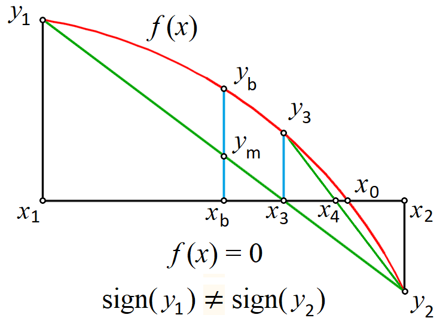

# Numerical methods

CalcpadCE has a built in "**Solver**" module, which can solve more difficult problems using numerical methods.
It can work only with real numbers but not complex.
It includes the following functions:

## Root finding

```calcpad
$Root{f(x) = const @ x = a : b}
$Root{f(x) @ x = a : b}
```

It finds a single root for an equation of type " **f**(*x*) = const" within the interval \[*a*, *b*\]. If "const" is zero, you can omit "= const". The program uses a [hybrid bracketing method](https://iopscience.iop.org/article/10.1088/1757-899X/1276/1/012010), which is a combination of Bisection and Anderson-Bjork's method.
It subsequently narrows the interval around the root, until it gets smaller than the specified precision.
It is required that the function "**f**(*x*) - const" has opposite signs at the ends of the interval.
According to Boltzano’s theorem, if the function is continuous within the interval, at least one root exists.
The bracketing algorithm will find an approximation after a finite number of iterations.



With this method, you can find only roots where the function crosses the line at "*y* = const". When " **f**(*x*) - const" is entirely positive or negative and only "touches" the line from one side, you cannot find the root by any bracketing method.

If no roots exist inside the initial interval, the program returns an error.
If there are several roots, it will find only one of them.
In such case, it is better to plot the function first.
Then, you can see the approximate location of roots and divide the interval into several parts - one for each root.
Finally, you can call the function several times to find all the roots.
In some cases, it is possible to develop an automated procedure for interval splitting.

## Minimum

```calcpad
$Inf{f(x) @ x = a : b}
```

It finds the smallest value for a function f(*x*) within the specified interval \[*a*, *b*\]. The golden section search method is applied for that purpose.
If the function contains a local minimum within the interval, it will be returned as a result.
Otherwise, the function will return the smaller of the values at the ends of the interval: f(*a*) or f(*b*). If there are several local minimums, the program will return only one of them, but not necessarily the smallest one.
In such cases, it is better to split the interval.
The value of *x* where the minimum is found is stored into a variable $x_{inf}$.
If you use different name for the argument, instead of *x*, it will add "\_inf" at the end of that name.

## Maximum

```calcpad
$Sup{f(x) @ x = a : b}
```

It works like the minimum finding function, but it finds the greatest value instead.
The value of *x* where the maximum is located is stored in a variable named $x_{sup}$.

## Numerical integration

```calcpad
$Area{f(x) @ x = a : b}
```

It calculates the value of the definite integral of a function f(*x*) within the specified interval \[*a*, *b*\]. Adaptive Gauss-Lobbato quadrature with Kronrod extension is applied for that purpose ([Gander & Gautschi](https://www.researchgate.net/publication/226706221_Adaptive_Quadrature-Revisited), 2000).

```calcpad
$Integral{f(x) @ x = a : b}
```

This command is similar to the above, but it uses the Tanh-Sinh quadrature ([Takahasi & Mori](https://ems.press/content/serial-article-files/41766), 1974) which has been additionally improved by [Michashki & Mosig](https://www.tandfonline.com/doi/epdf/10.1080/09205071.2015.1129915?needAccess=true) (2016) and [Van Engelen](https://www.genivia.com/files/qthsh.pdf) (2022). Further improvements have been made in CalcpadCE by precomputing and caching the abscissas and weights.
This algorithm significantly outperforms \$Area for **continuous** and **smooth** functions.
However, if the function does not satisfy these requirements, you **should not** use the \$Integral method.
Then, you have two options:

1. Divide the interval \[*a*, *b*\] into smaller parts by using the points of discontinuities, apply the method for each part separately, and sum up the results;
2. If you are not sure where the discontinuities are, use the \$Area method instead.

## Numerical differentiation

It finds the value of the first derivative of a real function f(*x*) at the specified point *x* = *a*. The geometric representation of derivative is the slope of the tangent to the function at point *a*. There are two methods that you can use in CalcpadCE for that purpose:

- `$Slope{f(x) @ x = a}` uses symmetric two-point finite difference with [Richardson extrapolation](https://royalsocietypublishing.org/doi/pdf/10.1098/rsta.1911.0009). It evaluates the derivative within the specified *Precision*. The function must be locally continuous, smooth and differentiable in the neighborhood of *a*. It can also contain other numerical methods.
In general, finite differences are susceptible to floating point round-off errors due to the subtraction of close values.
Although Richardson extrapolation can improve this significantly, the accuracy for poorly behaved functions may be limited.
- `$Derivative{f(x) @ x = a}` uses complex step method ([Lyness and Moler](https://epubs.siam.org/doi/abs/10.1137/0704019)). It evaluates the derivative with nearly machine precision ($10^{-15}$ to $10^{-16}$) by using the equation:

    $f'(a) = \Im(f(a + ih))/h$, where *i* is the imaginary unit and $h = 10^{-20}$. The function must be holomorphic in the complex plane - infinitely differentiable and locally equal to its Taylor expansion.
    Unlike `$Slope`, it cannot contain other numerical methods and should be defined only by analytic expressions.
    This limits the applicability of this method but, when possible, you can use it instead of `$Slope` to achieve higher accuracy, if needed.

## General considerations

Unlike the plotting command, you can include numerical methods in expressions.
They return values which can be used for further calculations.
For example, you can store the result into a variable:

```calcpad
y_min = $Inf{f(x) @ x = a : b}
```

Similarly to standard functions, "*x*" is local for all numerical methods and its global value is not modified after the method is called.
