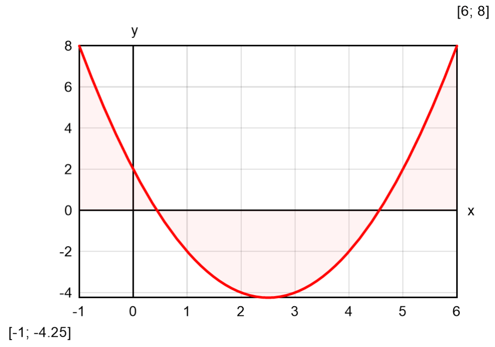
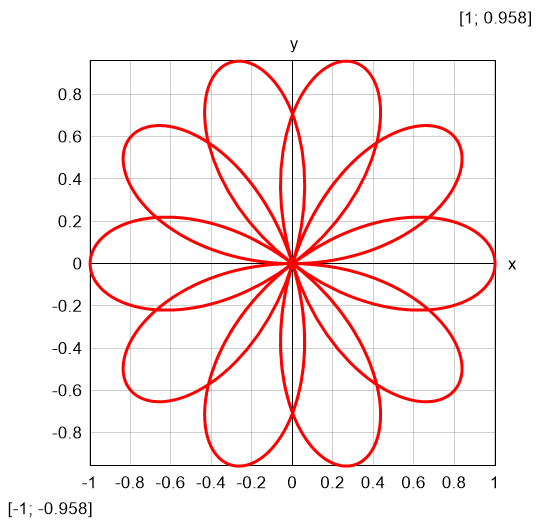
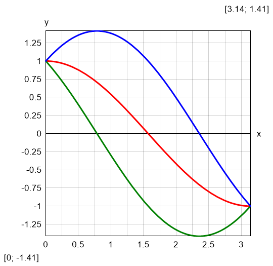
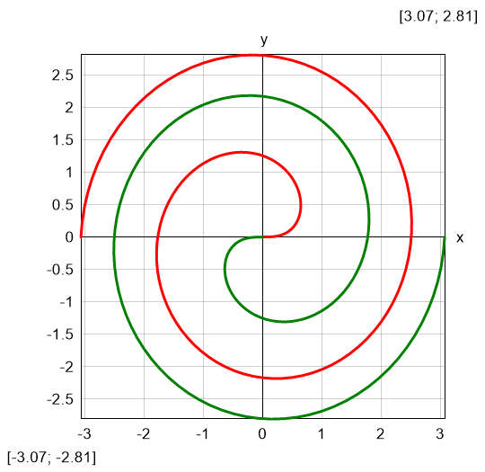
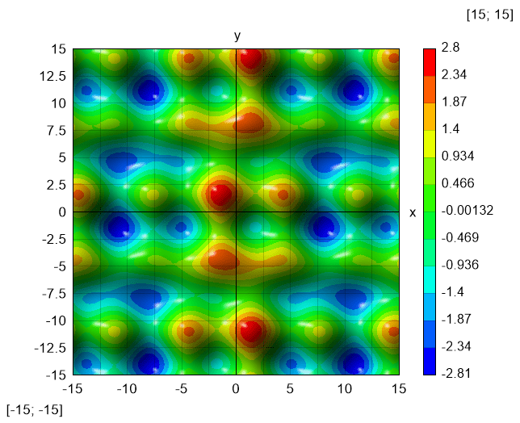

# Plotting

Besides functions, CalcpadCE provides special commands for advanced operations.
They accept functions and expressions as arguments and perform plotting, iterative solutions and numerical methods.
Their names start with "\$" to be distinguished from normal functions.
Their parameters must be enclosed in curly brackets: "{" and "}". Such is the plotting command \$Plot.
It can plot a function of one variable in the specified interval.
It has the following format:

```calcpad
$Plot{y(x) @ x = a : b}
```

Where:

- **y**(*x*) - the function to be plotted. Instead of **y**(*x*) you can put any valid expression. It will be used to calculate the ordinate values;
- *x* - the name of the variable along the abscissa. You can put here only a single name. It is not required to define the variable preliminary;
- *a* and *b* are the limits of the interval for the *x* variable. Instead of *a* and *b* you can put numbers, variables or any valid expressions.

For example, if you enter:

```calcpad
$Plot{x^2 - 5*x + 3 @ x = -1:6}
```

you will get the following result:



The above command plots only one function of one variable at a time.
There are also other formats that you can use:

- Parametric Plot: both coordinates are functions of a parameter
  ```calcpad
  $Plot{x(t) | y(t) @ t = a:b}
  ```
- Multiple: plots several functions on a single graph
  ```calcpad
  $Plot{y1(x) & y_2(x) & … @ x = a:b}
  ```
- Multiple Parametric:
  ```calcpad
  $Plot{x1(t) | y_1(t) & x_2(t) | y_2(t) & … @ t = a:b}
  ```
- Draws a 2D color map of a 3D surface, defined by f(*x*; *y*):
  ```calcpad
  $Map{f(x; y) @ x = a:b & y = c:d}
  ```

The `$Plot` function must be the first thing on a line.
You can have only spaces and tabs before, not even comments.
Otherwise, the program will return an error.
Any text after the closing bracket `}` will be ignored.
Plotting supports only real numbers.
You can use it in complex mode, only if *x* and *y* are real and the function returns real result along the plotting interval.

You can specify the size of the plot area by defining two variables: *PlotWidth* and *PlotHeight* in pixels.
The default values are *PlotWidth* = 400 and *PlotHeight* = 250. Plots can be in either in raster (PNG) or vector (SVG) format.
The vector format is usually smaller and faster than the raster one.
However, you may have problems with export to older version of Word or other software that does not support SVG.
You can turn this option on and off by setting the *PlotSVG* variable to 1 and 0, respectively.
Any nonzero value is equivalent to setting it to one.

Plotting a function requires multiple evaluations.
This is performed at uniformly spaced points of a dense mesh so that to catch any variations of function values.
However, if evaluations are computationally expensive, this approach can be very time-consuming.
In such cases, you can use adaptive plotting.
It starts with a coarse mesh and condenses it adaptively to the curvature.
Where the function is smoother, the mesh remains coarser, so that the total number of points is optimal and much less than for uniform mesh.
You can switch adaptive plotting on and off by clicking the "**Adaptive**" checkbox or setting the *PlotAdaptive* variable to 1 and 0, respectively.
Adaptive potting will work for relatively smooth plots with limited number of breaks and jumps.
If you have rapidly oscillating functions, it is possible to miss some peaks, so it is recommended to turn it off.

The `$Map` function can work with different color palettes.
Select the preferred one from the "**Palette**" combo box on the bottom of the program window.
If you check the "**Smooth**" checkbox, the coloring will be displayed as a smooth gradient.
Otherwise, the program will display strips.
You can also add 3D effects to the graph by selecting the "**Shadows**" checkbox.
You can also specify light direction by the respective combo.
Besides UI controls, you can specify these options by using variables at worksheet level, as follows:

| Parameter Name | Description
|----------------|------------
| *PlotShadows*  | Draw surface plots with shadows
| *PlotLightDir* | Direction to light source (0-7) clockwise:<br/>0 - North, 1 - NorthEast, 2 - East, 3 - SouthEast, 4 - South, 5 - SouthWest, 6 - West, 7 - NorthWest
| *PlotPalette*  | The number of color palette to be used for surface plots (0-9); 
| *PlotSmooth*   | Smooth transition of colors (= 1) or isobands (= 0) for surface plots.

## Examples

Examples of different plotting methods are provided below. Set Angles to "R" (icon bar).

### Parametric

```calcpad
r(θ) = cos(5/2*θ)  
$Plot{r(θ)*cos(θ)|r(θ)*sin(θ) @ θ = 0:6*π}
```

Result: "rose" curve  
{ width="300" }

### Multiple

```calcpad
y_1(θ) = cos(θ) - sin(θ)  
y_2(θ) = cos(θ) + sin(θ)  
$Plot{cos(θ) & y_1(θ) & y_2(θ) @ θ = 0:π}
```

Result: leaf by three trigonometric functions  
{ width="300" }

### Multiple Parametric

```calcpad
x(θ) = sqr(θ)*cos(θ)  
y(θ) = sqr(θ)*sin(θ)  
$Plot{x(θ)|y(θ) & -x(θ)|-y(θ) @ θ = 0:3*π}
```

Result: double Fermat spiral  
{ width="300" }

### Color Map

```calcpad
f(x; y) = cos(x/3) + sin(y) - sin(x)*cos(y/4)
$Map{f(x; y) @ x = -15:15 & y = -15:15}
```

Result: 2D waves  
{ width="300" }
