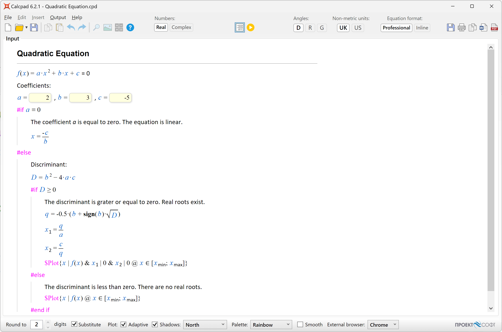
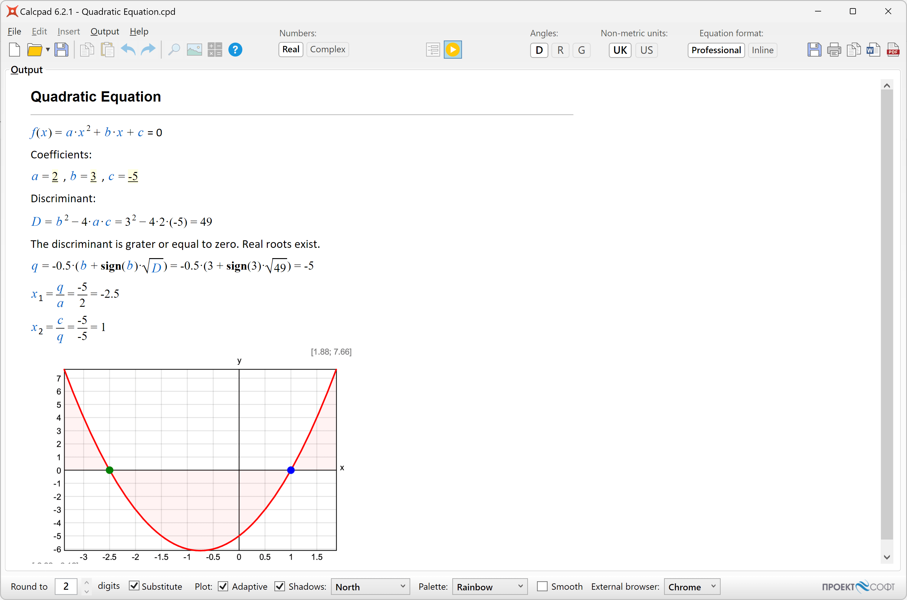
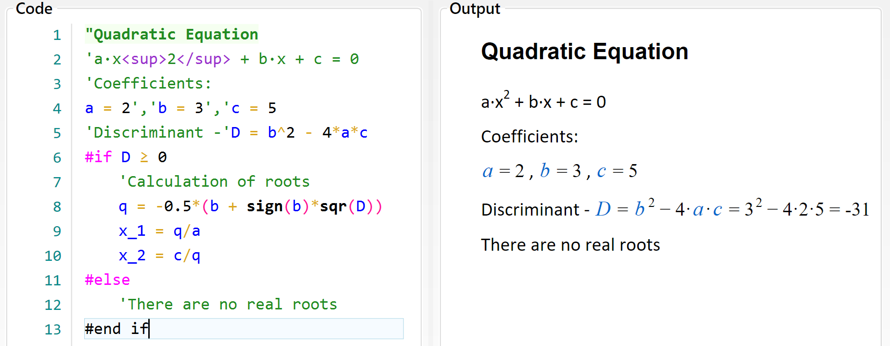
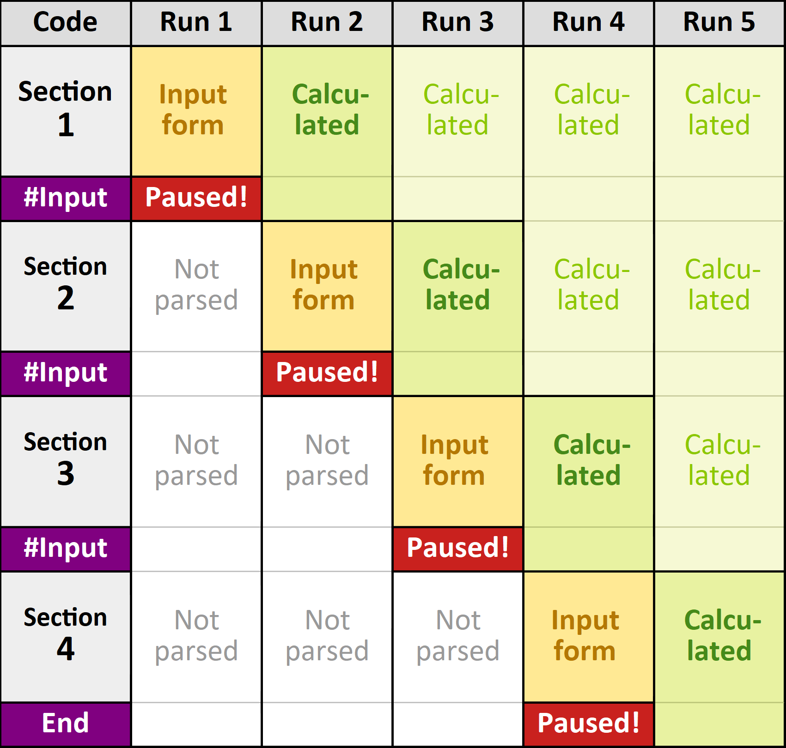

# Programming

## Input Forms

If you have a long and complicated problem or you want to share your solution with others, it is a good idea to create an input form.
It is very easy to do that with CalcpadCE.
Just replace the values that need to be entered with question marks "**?**", e.g. "*a* = ?". Please note that after that, you will not be able to calculate the results directly by clicking . You must compile it first to an input form.
For that purpose, click the  button or press **F4** from the keyboard.

The code will hide, and the form will be loaded into the "**Input**" box at the full width of the main window.
All texts and formulas will be rendered in Html format, protected from modification.
Input boxes will be generated at every occurrence of the "**?**" symbol except those in comments.
The ready-to-use input form will look as follows:



Now you have to fill in the input boxes and click  to calculate the results.
They are displayed in the "**Output**" box.



In order to return to input mode, click again  to switch the button off.
Input data will remain unchanged from the last input.
If you need to modify the source code, you have to unlock it by clicking the  button.
The "**Code**" box will show again at the left side of the main window.
Input data will be attached to the question marks.
If you hover the mouse over one of them, you will see the respective value.
Click on the question mark to change it.
When you finish editing the code, you can compile it back to input form.
The input values will be filled in the respective fields.
Finally, you can save the document as a "**\*.cpd**" file.
When you open such a file, it will be displayed directly into input form mode.
This format is more convenient to use than a simple text file due to the following advantages:

- The user can see clearly which parameters should be entered.
You can also provide pictures and additional explanations.
This is more comprehensible for the user, especially if the program is developed by someone else;

- The rest of the source code is protected from modification, unless you unlock it on purpose.
This prevents an inexperienced user from accidentally damaging the calculation formulas.

If you save the document as a "**\*.cpdz**" file, you will make the source code completely inaccessible.
It will not be possible to unlock it inside CalcpadCE anymore.
Also, no one could edit the file in external text editor, because it is encoded.
That is how you can protect your source code from unauthorized copying, viewing and modification.

You can put question marks "**?**" not only in variable definitions, but at any place in the code e.g.:

```calcpad
2 + ?
```

2 +
{style="height: 32px; vertical-align: text-bottom; margin-bottom: -5px;"}

Then, you can enter a value and calculate the result.
This approach is not recommended for complicated problems, because the program logic gets unclear and difficult to understand.

## Advanced UI with Html and CSS

Besides simple input boxes, you can use some advanced UI elements like "**select**" (combo box), "**radio**" buttons and "**checkboxes**" in your worksheets.
Since all the output from CalcpadCE is rendered as an Html document, you can use Html and CSS for that purpose.
However, CalcpadCE accepts input only from text boxes.
That is why, it is required to map every other UI element to some text box.
This is performed by enclosing the text box into an outer html element (paragraph or div) with a certain **id**. The same id must be assigned as a **name** or **data-target** attribute of the source UI element.
Then, the content of the source element's value attribute will be automatically filled in the target text box.
You can use the following sample code:

### Selection Box

```calcpad
'Select an option: <select name="**target1**">
'<option value="11;12">x1; y1</option>
'<option value="21;22">x2; y2</option>
'<option value="31;32">x3; y3</option>
'</select>
'...
'<p id="**target1**"> Values:'x = ? {21}','y = ? {22}'</p>
```

{style="width: 300px"}

### Radio Buttons

```calcpad
'<p>Select:
'<input name="target2" type="radio" id="opt1" value="1"/>
'<label for="opt1">option 1</label>
'<input name="target2" type="radio" id="opt2" value="2"/>
'<label for="opt2">option 2</label>
'...
'<p id="target2">Value -'opt = ? {2}'</p>
```

{style="width: 250px"}

### Check Box

```calcpad
'<p><input name="target3" type="checkbox" id="chk1" value="3"/>
'<label for="chk1">Checkbox 1</label></p>
'...
'<p id="target3">Value -'chk = ? {3}'</p>
```

{style="width: 120px"}

As you can see from the first example, one "value" attribute can contain multiple values, separated by semicolons ";". In this case, you have to provide the respective number of text boxes in the target paragraph.
You can copy the above code, add as many options as you like and write your own labels and values.
You can also change names and ids, but make sure that all source names match exactly the target ids, and no duplicate ids exist.

## Output Control

You can easily specify which parts of the code should be visible or hidden in the output.
Unlike conditional execution, the hidden code is always calculated.
It is just not displayed.
The following keywords can be used for that purpose:

- `#Hide` hides the contents after the current line;
- `#Pre` shows the contents in "input" mode only (see [Input forms](#input-forms) below);
- `#Post` shows the contents in "output" mode and hides it in "input" mode;
- `#Show` always shows the contents (revoke all other keywords);

Each of the above keywords affects the content after the current line and overrides the previous one.
You can use them to hide long and repetitive calculations that should not be visible.
You can use the `#Pre` command to add some directions about filling the input data and `#Post` to hide the calculation algorithm during data input.

You can also modify the display of the equations as follows:

- `#Val` shows only the final result as a single value;
- `#Equ` shows both the equation and the calculated result (default);
- `#Noc` shows only the equation, without results (no calculations).

Each of the above keywords overrides the other.
You can use `#Val` to create a table with values, but without the formulas, like in Excel.

## Conditional Execution

Sometimes the solution has to continue in different ways, depending on some intermediate values.
Such feature is included in CalcpadCE, similarly to other programming languages.
It is called "conditional execution block" and has the following general form:

```calcpad
#If condition1
    contents if condition1 is satisfied
#Else If condition2
    contents if condition2 is satisfied
#Else If condition3
    contents if condition3 is satisfied
. . .
#Else
    contents if none of the conditions is satisfied
#end if
```

Shorter forms are also possible:

```calcpad
#If condition
    contents if the condition is satisfied
#Else
    contents if the condition is not satisfied
#end if
```

or:

```calcpad
#If condition
    contents if the condition is satisfied
#end if
```

Condition blocks affect not only the calculation path but also the report content like text and images.
The "#" symbol must be the first one in the line.
At the place of "**condition**" you can put any valid expression.
Normally, a comparison is used like "#If *a* < 0", but it is not obligatory.
If it evaluates to any non-zero number, the condition is assumed to be satisfied.
Otherwise, it is not satisfied.
Any result which absolute value is ≤ 0.00000001 is assumed to be zero.

Let us look again at the quadratic equation example that we used earlier.
If we enter "*c* = 5", the discriminant will be negative, and the result will be NaN.
This is not a very intelligent way to finish a program.
What we need to do is to check if "*D* < 0" and if so, to provide a comprehensible message.
Otherwise, we have to calculate the roots.
We can do this, using conditional execution, as follows:



## Iteration Blocks

You can have simple iterations inside a CalcpadCE program.
For that purpose, you have to define a "**repeat-loop**" block:

```calcpad
#Repeat n
    code to be executed repeatedly
#Loop
```

The symbol *n* stands for the number of repetitions.
Instead of *n*, you can put a number, variable or any valid expression.
If the result of the expression is not integer, it is rounded to the nearest one.
You can exit the repeat-loop cycle prematurely by putting `#Break` inside the block.
It will make sense only if you combine it a conditional block.
Otherwise, it will always break at the same line, without performing any loops.
A typical "**repeat-break-loop**" will look like this:

```calcpad
#Repeat
    code to be executed repeatedly
    #If condition
        #Break
    #End if
    you can have more code here
#Loop
```

You can also use `#Continue` instead of `#Break` inside the condition.
The program will skip the remaining lines, return to the top of the loop block and continue with the next iteration.
You can omit the number of repetitions *n* only if you are sure that the condition will be satisfied, and you will leave the loop sooner or later.
However, to avoid infinite loops, the number of iterations is limited internally to 10 000 000.

Besides repetitive calculations, you can use loops to generate repetitive report content (like table rows). If you want to hide the iteration details, you can use output control directives (see the previous section). For example, you can enclose the "repeat-loop" block with `#Hide` and `#Show` statements.

Since version VM 7.0, two new iteration blocks were added: "for-loop" and "while-loop", as follows:

```calcpad
#For counter = start : end
    code to be executed repeatedly
    #Loop
#While condition
    code to be executed repeatedly
#Loop
```

## Interactive (Step-by-Step) Execution

You can make a CalcpadCE worksheet to execute interactively (step-by-step) by defining "breakpoints" at certain lines.
It will allow the user to review the intermediate results and enter some additional input data if needed.
There are two special keywords you can use for that purpose:

- `#Pause` calculates down to the current line, displays the results and waits for the user to resume;
- `#Input` renders an input form to the current line and waits the user to enter data and resume.

When the execution is paused, the program renders a message at the bottom of the report:

<span style="color: red";">Paused!</span>
Press **F5** to continue or **Esc** to cancel.

You can resume the execution by pressing **F5**, clicking the link or the  button again.
You can have several breakpoints in a single worksheet.
When you use the \#Input keyword, the previous section is calculated before the current input form is displayed.
In this way, the stages of calculation overlap as shown in the following example:



Additionally, the user can press "**Pause/Break**" or "**Ctrl + Alt + P**" any time from the keyboard to pause the execution.
The execution will pause at the current line as if `#Pause` is detected.

## Modules (Include)

CalcpadCE allows you to include content from external files in your worksheet.
If you have pieces of code that is repeated in different worksheets, you can organize it in modules and reuse it multiple times.
Also, if you have a longer worksheet, you can split it into modules that will be easier to maintain.
Then, you can include them into the main file by using the following statement:

```calcpad
#include filename
```

The "*filename*" must contain the full path to a local file.
If the file is the same folder as the current one, you can specify only the filename.

By default, CalcpadCE will include the whole contents of the external module.
However, you can prevent some parts from inclusion by making them local.
To start a "local" section in a module, add a new line, containing the `#local` keyword.
To end a "local" section (or start a "global" one), add a new line with the `#global` keyword.
CalcpadCE supports multiple levels of inclusions.
That means that the included file, in its turn, can reference other files and so on.

## Macros and String Variables

Macros and string variables are convenient ways to organize your code inside a single file and prevent repetitions.
They can be inline or multiline.
Unlike string variables, macros can have parameters.
You can define them by using the following statements:

Inline string variable:

```calcpad
#def variable_name$ = content
```

Multiline string variable:

```calcpad
#def variable_name$
    content line 1
    content line 2
    ...
#end def
```

Inline string macro:

```calcpad
#def *macro_name$(param1$; param2$;...) = content
```

Multiline string macro:  

```calcpad
#def macro_name$(param1$; param2$;...)
    content line 1
    content line 2  
    ...
#end def
```

Names of string variables, macros, and their parameters can contain small and capital Latin letters and underscore "\_". They must end with the "\$" symbol.
The contents can be virtually any string.
It is not necessary to be a valid CalcpadCE expression, since it is not processed by the parser at this stage.
However, other macro/string variable definitions are not allowed inside.
You can insert only references to previously defined ones.
Also, input fields "?" are not supported in macros yet.
This feature will be developed in the next versions.
You can use `#include` inside macros, but only if the included file does not contain other macros.

After a string variable is defined, you can use it anywhere in the code by writing its name (with the ending "\$"). The same is for macros, but you also need to specify values for parameters.
Macros and string variables are preprocessed and rewritten before the actual parsing is performed.
As a result, intermediate (unwrapped) code is generated.
You can review it by checking the "**Unwrapped code**" checkbox below the "**Output**" window.

If any errors occur during macro preprocessing, the unwrapped code is displayed, together with the errors.
Line numbers in error descriptions refer to your initial code.
If preprocessing is completed successfully, the unwrapped code is parsed and calculated as normal.
If errors are detected at this stage, they are displayed in the output.
Line numbers in error descriptions refer to the unwrapped code.
You can go to the respective line by clicking the link on the line number.

## Import/Export of External Data

You can import and export numerical data from/to text, CSV and Excel files.
Inside CalcpadCE, data should be stored in a matrix/vector variable.
You can also read and write partial data by specifying the desired range.
Structured storage of special matrices is supported for saving space.
The following commands are available:

### Text/CSV Files

Reads data from the specified text/CSV file into the matrix/vector *M*. The file must exist:

```calcpad
#read M from filename.txt@R1C1:R2C2 TYPE=R SEP=','
```

Writes data from matrix/vector *M* to the specified text/CSV file.
If the file exists, it is entirely overwritten.
Otherwise, a new file is created.
In all cases, the path to the file must exist.

```calcpad
#write M to filename.txt@R1C1:R2C2 TYPE=N SEP=','
```

Appends data from matrix/vector *M* to the specified text/CSV file.
If the file exists, the data is appended at the end of the existing file.
Otherwise, a new file is created.
In all cases, the path to the file must exist.

```calcpad
#append M to filename.txt@R1C1:R2C2 TYPE=N SEP=','
```

Command options:

- `M` the name of the matrix/vector that contains the data \[required\];
- `filename.txt` the name and path of the input/output file \[required\]. If the path is omitted, the file is assumed to be in the same folder.
    Extension is required.
    Any valid extension is allowed (except those for Excel), including **txt** and **csv**, as long as the data in the file is in text format;
- `@R1C1:R2C2` data range in the input file \[optional\]:
    - `R1C1` starting row and column indexes \[optional\]:
    - `R1` row index: includes capital letter “R”, followed by the number of the row \[optional\];
    - `C1`column index: capital letter “C”, followed by the number of the column \[optional\];
    - `:R2C2` ending row (R2) and column (C2) indexes as above \[optional\];

    Indexing starts at **1**. You can skip any of the starting and ending row/column indexes.
    In this case, the default values of 1 and matrix dimensions are taken.
    Starting indexes can be greater than ending ones.
    Some examples are given below:

    

- `TYPE=R` The type of matrix/vector for structured storage \[optional\].  
    For the `#read` command, TYPE can be any of the following capital letters:
    - `R` rectangular matrix (default);
    - `C` column matrix;
    - `D` diagonal matrix;
    - `S` symmetric skyline matrix;
    - `L` lower triangular matrix;
    - `U` upper triangular matrix;
    - `V` vector.

    If you want to use the high-performance version of the type, add **\_hp** after the type letter.
    For example: **R_hp** or **S_hp** .  
    For column and diagonal matrices values can be stored either on a single line or in a column of one value per line.
    For diagonal matrices only the values along the main diagonal are stored, for lower triangular - only below the main diagonal, and for symmetric and upper triangular - only above the main diagonal.
    Vector values can be spread along multiple lines, but all are collected in a single vector consequently line-by-line.
    Examples for structured storage are provided below:

    

    For the `#write` and `#append` commands TYPE can be one of the capital letters below:

    - `Y` Yes, the matrix structure is used;
    - `N` No, the matrix structure is not used (default);

    If “**N**” is selected, all matrices are stored as rectangular, regardless their type and internal structure.
    All elements after the last nonzero value on the row are skipped.
- `SEP=','` separator \[optional\]. You must specify a single character in quotes.
    For the \#read command it must correspond to the actual separator used in the input file.

The minimum allowed syntax for the above commands if all optional keywords are skipped is:

- `#read M from filename.txt` or
- `#write M to filename.txt` or
- `#append M to filename.txt`

### Excel Files

Reads the data from the specified Excel file into the matrix/vector *M*. The file must exist as well as the specified worksheet:

```calcpad
#read M from filename.xlsx@Sheet1!A1:B2 TYPE=R
```

Writes data from matrix/vector *M* to the specified Excel file.
A new file with a single worksheet is created.
If the file exists, it is entirely overwritten.
The path to the file must exist;  

```calcpad
#write M to filename.xlsx@Sheet1!A1:B2 TYPE=N
```

Appends data from matrix/vector *M* to the specified Excel file.
If the file exists, the data is written in the existing file at the specified location.
Otherwise, a new file is created.
In all cases, the path to the file must exist.

```calcpad
#append M to filename.xlsx@Sheet1!A1:B2 TYPE=N
```

Command options:

- `M` the name of the matrix/vector that contains the data \[required\];
- `filename.xlsx` the name and path of the input/output file \[required\]. If the path is missing, the file is assumed to be in the same folder.
    The supported extensions are **xlsx** and **xlsm**;
- `@Sheet1` the name of the target worksheet \[optional\].
    If omitted the first worksheet is used for existing files and Sheet1 is assumed for newly created worksheets.
- `!A1:B2` target cell range \[optional\]:
    - `A1` starting cell reference \[optional\], where A is the column name and 1 is the row index;
    - `:B2` ending cell reference as above \[optional\];  
    Column names start at **A**, and row numbers start at **1**. You can skip any of the starting and ending column/row references.
    In this case, data is read to the first and last nonempty cells, respectively.
    The starting cell references can be greater than the ending ones.
    Examples for data import settings are provided below:

    

    The behavior of data export commands `#write` and `#append` is a bit different.
    The starting reference indicates the location of the first element $M_{1,1}$ of the output matrix.
    So, even if it is greater than A1, it will not truncate the first rows and columns.
    Unless bound by the ending reference, the entire matrix will be written after the specified location.
    Otherwise, the remaining rows and columns after the ending reference will be truncated.
    For example: `#write M to filename.xlsx@Sheet1!C2` will produce the following output:

    {style="width: 300px;"}

- `TYPE=R` type of matrix/vector for structured storage \[optional\]. The same rules apply as for text/CSV files above.
