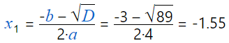
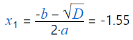
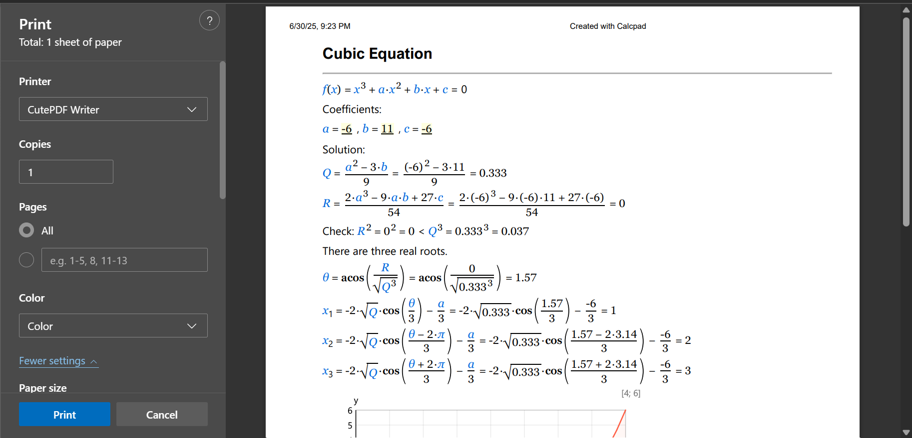

# Results

You can run the solution by pressing **F5** or clicking the  button.
The results will appear in the "**Output**" box.
You cannot edit the output content, but you can select, copy and print it.
For that purpose, you can use the toolbar above the "**Output**" box on the right.
You can also use additional commands from the context menu, that is displayed If you right-click inside the "**Output**" box, you will see a pop-up menu with additional commands.
Detailed description is provided further in this manual.

Since version 6.5.3, you can use the "☑ **AutoRun**" mode.
While it is checked, the results will refresh each time you change the code and move to another line.
If you need to synchronize the results manually, you can press "**Ctrl + Enter**". Additionally, the output window will scroll to match the current position in the source code.
You can do the same by double clicking into the input window.

## Substitution

CalcpadCE can substitute the values of variables in all formulas in the output, just before the answer:



For that purpose, you need to check the "**Substitution**" checkbox at the bottom of the program window.
That makes the results easy to review and check.
This is important when calculations have to be checked by supervisors, teachers etc.
This is also an advantage over the spreadsheet software where the actual formulas are hidden in the cells.

If you do not need the substitution, you can uncheck this option.
Then the answers will follow directly the calculation formulas:



After that, if you position the mouse over a variable, you will see a tooltip with the respective value.

There is also an option to control the variable substitution behavior inside worksheets.
You can use the following switches for that purpose:

- `#nosub` do not substitute variables (no substitution)
- `#novar` show equations only with substituted values (no variables)
- `#varsub` show equations with variables and substituted values (default)

If an equation gets too long and does not fit on a single line, you can choose the way it looks in the output by using these two switches:

- `#split` the equation is split after the "=" symbol
- `#wrap` the equation is wrapped at the end of the line (default)

## Rounding

Rounding is specified by the number of digits *n* after the decimal point.
It is entered into the "**Rounding**" input box at the bottom of the program window.
The value of *n* can be between "0" and "15". If you enter "0", all results will be rounded to integers.
If the value is less than "0" or greater than "15", the respective limit will be taken.

However, rounding can come across some potential problems.
If the result is less than 10-*n* and you round it to *n* digits after the decimal point, the result will contain only zeros.
That is why, CalcpadCE incorporates some advanced rules: If the output contains less than *n* significant digits after rounding, it is expanded up to *n* significant digits.
Even then, if the number is too small, it will be difficult to count the zeros after the decimal point.
So, in such cases, the output is converted to floating point format with *n* digits.
When the total number of digits becomes greater than 2*n*, the factional part is being truncated.
In this way, the output becomes easier to read, still providing at least 2*n* significant digits.
You can see several examples below, obtained for *n* = 3.

| Code | Output |
| ---- | ------ |
| `0.000001 * π` | $3.14{×}10^{-6}$ |
| `0.001 * π` | $0.00314$ |
| `0.1 * π` | $0.314$ |
| `1 * π` | $3.142$ |
| `1000 * π` | $3141.59$ |
| `1000000 * π` | $3141593$ |

Rounding affects only the way in which numbers are displayed in the output.
Internally, all numbers are stored with the maximum possible precision.
That is why, if you print the output and try to repeat the calculations with the numbers from the report, you probably will get some little differences.
This is because you use the rounded values instead of the actual ones.

You can override the global rounding inside a worksheet by using the `#Round n` keyword, where *n* is the number of digits after the decimal point (from "0" to "15"). To restore the global rounding, enter `#Round` default.

## Formatting

CalcpadCE does not simply calculate formulas.
It also builds a professionally looking report out of your source code.
It uses Html to format the output.
It is widely recognized and allows you to publish your calculations on the web.
You can select between two different styles for equation formatting: "**professional**" and "**inline**". The professional style uses division bar, large and small brackets, radical, etc.
Numerator and denominator are displayed one above the other.
The inline style uses slash for displaying division and all symbols are arranged in a single line.
The following formatting rules apply:

- Intervals are maintained automatically.

- Variables are formatted as *italic*.

- Multiplication operator "\*" is replaced with "∙".

- Exponentiation operator "^" is formatted as superscript.

- Underscore "\_" is formatted as subscript.

- Square root function is replaced with radical √‾.

Several examples of formatting in different cases are provided in the table below:

| Code         | Output                             |
|--------------|------------------------------------|
| `x + 3`      | *x* + 3                            |
| `x - 3`      | *x* – 3                            |
| `3 * x`      | 3∙*x*                              |
| `(x + 1)/3`  | (*x* + 1)/3 or $`\frac{x + 1}{3}`$ |
| `x + 3 * y`  | *x* + 3∙*y*                        |
| `sqr(x+3)`   | $\sqrt{x + 3}$                     |
| `x_1^3`      | $x_1^3$                            |
| `sin(x)`     | **sin**(*x*)                       |

Html formatting makes the report easier to read and check than the respective plain text.
You can also insert additional Html code inside the comments that will affect the final appearance.
In this way, you can use CalcpadCE code to build professional Web applications.
You will also need the cloud version of CalcpadCE for that purpose.

CalcpadCE uses for decimal separator the symbol defined in the Windows' Regional Settings.

## Custom Format Strings

You can specify format strings for different parts of your worksheet and even for individual output values.
At worksheet level you can do that by following command:

```calcpad
#format format string
```

To restore the default formatting, add the following line:

```calcpad
#format default
```

To specify a custom format string for an individual output value, add a colon followed by the respective string, e.g.:

```calcpad
x = 12.345:format string
```

If you have units, the format specifier is positioned after the units:

```calcpad
x = 12.345cm:format string
```

There are several types of format strings that you can use:

### Exponential

Engineering or scientific: `En` or `en`.

`n` range: 0-17  
`n` default value: 6

| Code | Output |
| ---- | ------ |
| `123456.789:e` | $1.234568\mathrm{e}{+}005$ |
| `0.00123456:e2` | $1.23\mathrm{e}{-}003$ |
| `123456789:E3` | $1.235{×}10^{+008}$ |

### Fixed-point

Displays always fixed-point: `Fn` or `fn`.

`n` range: 0-17  
`n` default value: 2

| Code | Output |
| ---- | ------ |
| `123.456789:f` | $123.46$ |
| `0.00123456:F5` | $0.00123$ |
| `123:F2` | $123.00$ |

### General

Displays either fixed point or scientific: `Gn` or `gn`

`n` range: 0-17  
`n` default value: 15

| Code | Output |
| ---- | ------ |
| `123.456789:g` | $123.456789$ |
| `0.0012345678:g3` | $0.00123$ |
| `123456m:G3` | $1.23×10^5 \mathrm{m}$<br>(with unit "Meters") |

### Number

Fixed point with digit grouping: `Nn` or `nn`

`n` range: 0-17  
`n` default value: 2

The symbols defined in Windows' Regional Settings are used for thousands and decimal separators.

| Code | Output |
| ---- | ------ |
| `123.456789:n` | $123.46$ |
| `0.0012345678:N3` | $0.001$ |
| `123456:N3` | $123\mathrm{,}456.000$ |

### Currency

Fixed point with currency symbol and digit grouping: `Cn` or `en`

`n` range: 0-17  
`n` default value: 2

The currency symbol defined in Windows' Regional Settings is used.

| Code | Output |
| ---- | ------ |
| `123.456789:C` | $123.46 €$ |
| `0.0012345678:C3` | $0.001 €$ |
| `123456:C` | $123\mathrm{,}456.00 €$ |

### Custom

The following characters can be used to compose a custom formatting:

- `0` - zero placeholder. Displays either a digit or zero if a digit is not available.
- `#` - optional digit placeholder. Displays a digit if available or nothing.
- `.` - decimal separator
- `,` - group separator
- `E`, `e`, `E+`, `e+`, `E-`, `e-` - exponential notation

| Code | Output |
| ---- | ------ |
| `123.456789:000000` | $000123$ |
| `123.45:0.0000` | $123.4500$ |
| `123.45:0.####` | $123.45$ |
| `0.00123456:#.#####` | $.00123$ |
| `1234567:#,#.0` | $1\mathrm{,}234\mathrm{,}567.0$ |
| `1234567:0.00e+00` | $1.23\mathrm{e}{+}06$ |
| `1234567:0.00e-0` | $1.23\mathrm{e}6$ |
| `0.01234:#.##e-000` | $1.23\mathrm{e}{-}002$ |
| `0.12:0.000e-00` | $1.200\mathrm{e}{-}0$ |

## Scaling

You can scale up and down the text size in the output window.
Hold the "**Ctrl**" button and rotate the mouse wheel.
The forward rotation will scale up and the backward will scale down.

## Saving the Output

You can save the output to an **Html** file . Unlike the input file, it cannot be modified with CalcpadCE.
On the other hand, everyone will be able to view and print your calculations without CalcpadCE.
Html files can be opened on any computer using web browser or office program like Word.

You can save the file by clicking the  button above the output box.
Then select a file name and click "**Save**".

## Printing

You can print the output by clicking the  button.
Normally, printing is performed after calculations.
When you click the button, the print preview dialog will be displayed:



It allows you to set the paper layout, margins, size, type, etc.
Printing in CalcpadCE uses the built-in functionality of Windows and Edge.
The above screenshots may look different on your computer, depending on the versions you use.

## Copying

You can copy the entire output at once by clicking the  button above the output window.
Then, you can paste it in any other program.
If the target program supports Html, like Word, the formatting will be preserved.
Otherwise, the content will be pasted as plain text.

## Export to Word

You can open the results directly with **MS Word** by clicking . It must be installed on the computer, but it is not necessary to be preliminary open.
This approach is easier than copy-paste and provides some additional benefits.
If the output is obtained with the professional equation formatting option, CalcpadCE will use the "**\*.docx**" file format for export.
This is the native format for the latest versions of **MS Word** and will open automatically.
If you have **Open Office** or **Libre office**, the respective program will be used instead.
If you do not have any text editor currently installed, the file will be saved to the disk but not open.
You can go to the respective folder later and open it manually.
Formulas are exported as **MathType** objects and can be modified inside Word.
However, it is possible to lose part of the Html formatting.
Images, tables and most common tags are supported.
If you have selected inline equation formatting, CalcpadCE will use an **Html** file for the export.
It will preserve most of the formatting, but formulas will be part of the document text.

## Export to PDF

A good alternative to **Html** is to save the report as **pdf** file.
It is another way to make a hard copy of your calculations.
Click the  button and select the name and the location of the file.
The program will save the output to the specified file and open it with the default viewer.
The pdf is always generated in A4 page size.

Alternatively, you can use a pdf printer.
There are a lot of free pdf printers over the Internet.
Just download and install one.
After that, the process of printing is not much different than any other printer.
Detailed description of printing from CalcpadCE is provided above.
