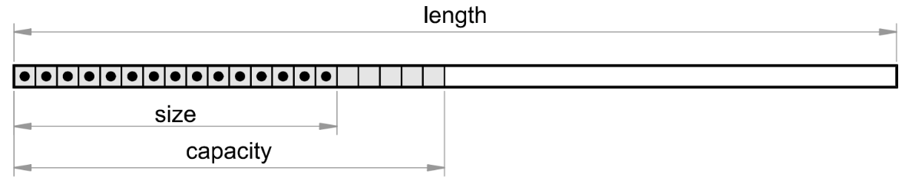

# Vectors

## Internal implementation and types of vectors

There are two types of vectors in CalcpadCE: regular (small) and large.
Vectors can contain only real numbers with units.
Complex vectors are not supported in this version.
A single vector can contain different types of units, even if not consistent.
However, some vector functions or operators may fail due to units’ inconsistency between separate elements.

Vectors with length that is greater than 100 are created as "large". Externally they behave just as regular vectors, so the user cannot make any difference.
But internally, they operate quite differently.
The structure of a large vector is displayed on the figure below:



A vector is defined with its full "mathematical" length, but no memory is initially reserved for it.
This length can be obtained by the **len**($\vec{v}$) function.
The greatest index of a non-zero element defines the internal size of a vector.
It is returned by the **size**($\vec{v}$) function.
The rest of the elements are known to be zero, so CalcpadCE does not need to store them in memory.
Instead, it returns directly zero, if such an element is accessed.

This allows the software to work efficiently with vectors that are not entirely filled.
Such vectors are very common in engineering as is the load vector in finite element analyses.
However, CalcpadCE reserves a little bit more memory above the size, that is called "capacity". This is because resizing a vector is computationally expensive.
Since we normally assign elements in a loop, in this way we avoid resizing the vector on each iteration.

## Definition

Vectors can be defined by using the following syntax:

```calcpad
a = [ a_1; a_2; a_3; ... ; a_i; ... ; a_n ]
```

The values of the separate elements can be specified by expressions that include variables, operators, functions, etc.
For example:

`a = [cos(0); 2; 3; 2*2; 6 - 1]` $= [1\ 2\ 3\ 4\ 5]$

You can also include other vectors in the list.
Their elements will be included in the sequence at place, as follows:

`b = [0; a; 6; 7; 8]` $= [0\ 1\ 2\ 3\ 4\ 5\ 6\ 7\ 8]$

If you include matrices, they will be linearized to vectors by augmenting all rows one after the other.
Vectors can be also defined as functions that will create them dynamically, depending on certain input parameters.
For example:

`a(x) = [1; x; x^2; x^3; x^4]`  
`a(2)` $= [1\ 2\ 4\ 8\ 16]$

Besides square brackets, you can also define vectors by using creational functions, as follows:

`a = vector(5)` $= [0\ 0\ 0\ 0\ 0]$ - creates an empty vector with 5 elements;  
`fill(a; 5)` $= [5\ 5\ 5\ 5\ 5]$ - fills the vector with a value of 5;  
`a = range(0; 10; 2)` $= [0\ 2\ 4\ 6\ 8\ 10]$ - creates a vector from a range of values starting from 0 to 10 with step 2.

## Indexing

You can access individual elements of a vector for reading and writing by using indexes.
You have to specify the vector name, followed by a dot "." and the index after that.
The first element has an index of one.
The index can be a number, a single variable or expression.
In the last case, the expression must be enclosed by brackets.
For example:

`a = [2; 4; 6; 8; 10]`  
`a.2` $= 4$  
`k = 3`, `a.k` $= \vec{a}_{3} = 6$  
`a.(2*k - 1)` $= \vec{a}_{5} = 10$

If an index value is less than 1 or greater than the vector length **len**($\vec{a}$), the program will return an error: Index out of range.
You can use indexing to initialize vectors inside loops (block or inline). For that purpose, you must include the loop counter into the index.
For example:

```calcpad
a = vector(6)','b = vector(6)
'Block loop
#for k = 1 : len(a)
a.k = k^2
#loop
'Inline loop
$Repeat{b.k = a.(k - 1) @ k = 2 : len(b)}
```

The above code will produce the following two vectors:

$a = [1\ 4\ 9\ 16\ 25\ 36]$ and  
$b = [0\ 1\ 4\ 9\ 16\ 25]$

## Structural functions

This includes all functions that read or modify the structure of the vector.
It means that the result does not depend on the content, i.e. the values of elements.
The following functions are available in CalcpadCE:

### **len**($\vec{a}$)

**Parameters**:

$\vec{a}$
:   vector

**Return value**:
:   (scalar) the length of vector $\vec{a}$.

!!! note
    Represents the full length of the vector (in respect to element count).

!!! example
    `len([1; 0; 2; 3])` $= 4$

### **size**($\vec{a}$)

**Parameters**:

$\vec{a}$
:   vector

**Return value**:
:   (scalar) the internal size of vector $\vec{a}$.

!!! note
    If $\vec{a}$ is a large vector, returns the index of the last non-zero element, else returns the vector length.

!!! example
    `a = vector(200)`  
    `a.35 = 1`  
    `len(a)` $= 200$  
    `size(a)` $= 35$  
    `size([1; 2; 3; 0; 0])` $= 5$

### **resize**($\vec{a}$; *n*)

**Parameters**:

$\vec{a}$
:   vector

*n*
:   (positive integer) the new length of vector $\vec{a}$

**Return value**:
:   the resized vector $\vec{a}$.

!!! note
    Sets a new length *n* of vector $\vec{a}$ by modifying the vector in place and returns a reference to the same vector as a result.

!!! example
    `a = [1; 2; 3; 4; 5]`  
    `b = resize(a; 3)` $= [1\ 2\ 3]$  
    `a` $= [1\ 2\ 3]$

### **join**(*A*; $\vec{b}$; *c*…)

**Parameters**:
:   a list of matrices, vectors and scalars.

**Return value**:
:   a new vector, obtained by joining the arguments in the list.

!!! note
    The list can include unlimited number of items of different types, mixed arbitrarily. Matrices are first linearized by rows and their elements are included into the common sequence, as well as the vectors, each at its place.

!!! example
    `A = [1; 2|3; 4]`  
    `b = [7; 8; 9]`  
    `c = join(0; A; 5; 6; b)` $= [0\ 1\ 2\ 3\ 4\ 5\ 6\ 7\ 8\ 9]$

### **slice**($\vec{a}; i_1; i_2$)

**Parameters**:

$\vec{a}$
:   vector

$i_1$
:   (positive integer) starting index

$i_2$
:   (positive integer) ending index

**Return value**:
:   a new vector, containing the part of vector $\vec{a}$ bounded by indexes $i_1$ and $i_2$, inclusively.

!!! note
    It is not required that $i_1$ ≤ $i_2$. If an index is greater than the vector length, then all remaining elements are returned to the end.

!!! example
    `slice([1; 2; 3; 4; 5; 6; 7; 8]; 3; 7)` $= [3\ 4\ 5\ 6\ 7]$  
    `slice([1; 2; 3; 4; 5; 6; 7; 8]; 6; 10)` $= [6\ 7\ 8]$

### **first**($\vec{a}$; *n*)

**Parameters**:

$\vec{a}$
:   vector

*n*
:   (positive integer) the number of elements to return

**Return value**:
:   a vector containing the first *n* elements of $\vec{a}$.

!!! note
    If *n* is greater than the length of $\vec{a}$, then all elements are returned. Unlike **resize** the original vector is not modified.

!!! example
    `first([0; 1; 2; 3; 4; 5]; 3)` $= [0\ 1\ 2]$  
    `first([0; 1; 2; 3; 4; 5]; 10)` $= [0\ 1\ 2\ 3\ 4\ 5]$

### **last**($\vec{a}$; *n*)

**Parameters**:

$\vec{a}$
:   vector

*n*
:   (positive integer) the number of elements to return

**Return value**:
:   a vector containing the last *n* elements of $\vec{a}$.

!!! note
    If *n* is greater than the length of $\vec{a}$, then all elements are returned.

!!! example
    `last([0; 1; 2; 3; 4; 5]; 3)` $= [3\ 4\ 5]$  
    `last([0; 1; 2; 3; 4; 5]; 10)` $= [0\ 1\ 2\ 3\ 4\ 5]$

### **extract**($\vec{a}$; $\vec{i}$)

**Parameters**:

$\vec{a}$
:   a vector containing the elements to be extracted

$\vec{i}$
:   a vector with the indexes of the elements to be extracted from $\vec{a}$

**Return value**:
:   a vector with the extracted elements from $\vec{a}$ which indexes are provided in $\vec{i}$.

!!! note
    All indexes in $\vec{i}$ must be positive integers. If an index is greater than the length of vector $\vec{a}$, an "Index out of range" error is returned.

!!! example
    `a = [0; 1; 2; 3; 4; 5; 6]`  
    `extract(a; [2; 4; 6])` $= [1\ 3\ 5]$

## Data functions

This kind of functions treat the vector contents as numerical data.
They are related mainly to sorting, ordering, searching and counting.
Unlike structural functions, the result depends on the element values.
You can use the following functions:

### **sort**($\vec{a}$)

**Parameters**:

$\vec{a}$
:   input vector

**Return value**:
:   a vector containing the elements of $\vec{a}$, sorted in ascending order.

!!! note
    The original content of $\vec{a}$ is not modified.

!!! example
    `a = [4; 0; 2; 3; -1; 1]`  
    `b = sort(a)` $= [-1\ 0\ 1\ 2\ 3\ 4]$  
    `a` $= [4\ 0\ 2\ 3\ -1\ 1]$

### **rsort**($\vec{a}$)

**Parameters**:

$\vec{a}$
:   input vector

**Return value**:
:   a vector containing the elements of $\vec{a}$, sorted in descending order.

!!! note
    Similar to **sort**, the original content of $\vec{a}$ remains unchanged.

!!! example
    `rsort([4; 0; 2; 3; -1; 1])` $= [4\ 3\ 2\ 1\ 0\ -1]$

### **order**($\vec{a}$)

**Parameters**:

$\vec{a}$
:   input vector

**Return value**:
:   a vector with indexes, ordered by the elements of $\vec{a}$, ascendingly.

!!! note
    Each index in the output vector $\vec{i}$ shows which element in $\vec{a}$ should be placed at the current position to obtain a sorted sequence. You can do that by calling **extract**($\vec{a}$; $\vec{i}$).

!!! example
    `a = [4; 0; 2; 3; -1; 1]`  
    `i = order(a)` $= [5\ 2\ 6\ 3\ 4\ 1]$  
    `b = extract(a; i)` $= [-1\ 0\ 1\ 2\ 3\ 4]$

### **revorder**($\vec{a}$)

**Parameters**:

$\vec{a}$
:   input vector

**Return value**:
:   a vector with indexes, ordered by the elements of $\vec{a}$, descending.

!!! note
    The same considerations as for the **order** function apply.

!!! example
    `revorder([4; 0; 2; 3; -1; 1])` $= [1\ 4\ 3\ 6\ 2\ 5]$

### **reverse**($\vec{a}$)

**Parameters**:

$\vec{a}$
:   input vector

**Return value**:
:   a vector containing the elements of $\vec{a}$ in reverse order.

!!! note
    The original content of $\vec{a}$ remains unchanged.

!!! example
    `reverse([1; 2; 3; 4; 5])` $= [5\ 4\ 3\ 2\ 1]$

### **count**($\vec{a}$; *x*; *i*)

**Parameters**:

$\vec{a}$
:   vector

*x*
:   (scalar) the value to count

*i*
:   (positive integer) the index to start with

**Return value**:
:   (scalar) the number of elements in $\vec{a}$, after the i-th one, that are equal to *x*.

!!! note
    If *i* is greater than the length of $\vec{a}$, then zero is returned.

!!! example
    `count([0; 1; 2; 1; 4; 1]; 1; 4)` $= 2$

### **search**($\vec{a}$; *x*; *i*)

**Parameters**:

$\vec{a}$
:   vector

*x*
:   (scalar) the value to search for

*i*
:   (positive integer) the index to start with

**Return value**:
:   (scalar) the index of the first element in $\vec{a}$, after the i-th, that is equal to *x*.

!!! note
    If *i* is greater than the length of $\vec{a}$ or the value is not found, zero is returned.

!!! example
    `search([0; 1; 2; 1; 4; 1]; 1; 3)` $= 4$  
    `search([0; 1; 2; 1; 4; 1]; 1; 7)` $= 0$

### **find**($\vec{a}$; *x*; *i*)

**Parameters**:

$\vec{a}$
:   vector

*x*
:   (scalar) the value to search for

*i*
:   (positive integer) the index to start with

**Return value**:
:   a vector with the indexes of all elements in $\vec{a}$, after the i-th, that are equal to *x*.

!!! note
    If *i* is greater than the length of $\vec{a}$ or the value is not found, an empty vector is returned (with zero length).

!!! example
    `find([0; 1; 2; 1; 4; 1]; 1; 2)` $= [2\ 4\ 6]$  
    `find([0; 1; 2; 1; 4; 1]; 3; 2)` $= []$

### **lookup**($\vec{a}$; $\vec{b}$; *x*)

**Parameters**:

$\vec{a}$
:   vector with reference values

$\vec{b}$
:   vector with return values

*x*
:   (scalar) the value to look for

**Return value**:
:   a vector with all elements in $\vec{b}$, for which the corresponding elements in $\vec{a}$ are equal to *x*.

!!! note
    If the value is not found, an empty vector is returned (with zero length).

!!! example
    `a = [0; 1; 0; 0; 1; 1]`  
    `b = [1; 2; 3; 4; 5; 6]`  
    `lookup(a; b; 0)` $= [1\ 3\ 4]$  
    `lookup(a; b; 2)` $= []$

The **find** and **lookup** functions have variations with suffixes.
Different suffixes refer to different comparison operators.
They replace the equality in the original functions while the other behavior remains unchanged.
The possible suffixes are given in the table below:

|  |  |  |  |
|----|----|----|----|
| suffix | find | lookup | comparison operator |
| \_eq | **find_eq**($\vec{a}$; *x*; *i*) | **lookup_eq**($\vec{a}$; $\vec{b}$; *x*) | = - equal |
| \_ne | **find_ne**($\vec{a}$; *x*; *i*) | **lookup_ne**($\vec{a}$; $\vec{b}$; *x*) | ≠ - not equal |
| \_lt | **find_lt**($\vec{a}$; *x*; *i*) | **lookup_lt**($\vec{a}$; $\vec{b}$; *x*) | \< - less than |
| \_le | **find_le**($\vec{a}$; *x*; *i*) | **lookup_le**($\vec{a}$; $\vec{b}$; *x*) | ≤ - less than or equal |
| \_gt | **find_gt**($\vec{a}$; *x*; *i*) | **lookup_gt**($\vec{a}$; $\vec{b}$; *x*) | \> - greater than |
| \_ge | **find_ge**($\vec{a}$; *x*; *i*) | **lookup_ge**($\vec{a}$; $\vec{b}$; *x*) | ≥ - greater than or equal |

## Math functions

All standard scalar math functions accept vector arguments as well.
The function is applied separately to each of the elements in the input vector and the results are returned in a corresponding output vector.
For example:

`sin([0; 30; 45; 90])` $= [0\ 0.5\ 0.707\ 1]$

CalcpadCE also includes several math functions that are specific for vectors:

### **norm_p**($\vec{a}$)

**Parameters**:

$\vec{a}$
:   vector

**Return value**:
:   scalar representing the $L_p$ norm of vector $\vec{a}$.

!!! note
    The $L_p$ norm is obtained by the formula: $`\left\| \overrightarrow{a} \right\|_{p} = \left( \sum_{i = 1}^{n}\left| a_{i} \right|^{p} \right)^{\frac{1}{p}}`$.

!!! example
    `norm_p([1; 2; 3]; 3)` $= 3.3019$

### **norm_1**($\vec{a}$)

**Parameters**:

$\vec{a}$
:   vector

**Return value**:
:   scalar representing the $L_1$ norm of vector $\vec{a}$.

!!! note
    The $L_1$ norm is obtained by the formula: $`\left\| \overrightarrow{a} \right\|_{1} = \sum_{i = 1}^{n}{a_{i} \vee}`$.

!!! example
    `norm_1([-1; 2; 3])` $= 6$

### **norm**($\vec{a}$) / **norm_2**($\vec{a}$) / **norm_e**($\vec{a}$)

**Parameters**:

$\vec{a}$
:   vector

**Return value**:
:   scalar representing the $L_2$ (Euclidian) norm of vector $\vec{a}$.

!!! note
    The $L_2$ norm is obtained by the formula: $`\left\| \overrightarrow{a} \right\|_{2} = \sqrt{\sum_{i = 1}^{n}a_{i}^{2}}`$.

!!! example
    `norm_2([1; 2; 3])` $= 3.7417$

### **norm_i**($\vec{a}$)

**Parameters**:

$\vec{a}$
:   vector

**Return value**:
:   scalar representing the $L_∞$ (infinity) norm of vector $\vec{a}$.

!!! note
    The $L_∞$ norm is obtained by the formula: $|| \vec{a} ||_∞$ = **max** $| a_i |$.

!!! example
    `norm_i([1; 2; 3]; 3)` $= 3$

### **unit**($\vec{a}$)

**Parameters**:

$\vec{a}$
:   vector

**Return value**:
:   the normalized vector $\vec{a}$ (with $L_2$ norm $|| \vec{a} ||_2$ = 1).

!!! note
    The elements of the normalized vector $\vec{a}$ are evaluated by the expression: $u_i = a_i / ||a||_2$

!!! example
    `unit([1; 2; 3])` $= [0.26726\ 0.53452\ 0.80178]$

### **dot**($\vec{a}$; $\vec{b}$)

**Parameters**:

$\vec{a}$, $\vec{b}$
:   vectors

**Return value**:
:   scalar representing the dot product of both vectors $\vec{a}$ · $\vec{b}$.

!!! note
    The dot product is obtained by the expression: $\vec{a}$ · $\vec{b}$ = $`\sum_{i = 1}^{n}{a_{i}{\bullet b}_{i}}`$

!!! example
    `a = [1; 2; 4]`  
    `b = [5; 3; 1]`  
    `dot(a; b)` $= 15$

### **cross**($\vec{a}$; $\vec{b}$)

**Parameters**:

$\vec{a}$, $\vec{b}$
:   vectors

**Return value**:
:   vector representing the cross product $\vec{c}$ = $\vec{a}$ × $\vec{b}$.

!!! note
    This function is defined only for vectors with lengths 2 or 3. The elements of the resulting vector $\vec{c}$ are calculated as follows:
    $c_1 = a_2 b_3 − a_3 b_2$,
    $c_2 = a_3 b_1 − a_1 b_3$,
    $c_3 = a_1 b_2 − a_2 b_1$.

!!! example
    `a = [1; 2; 4]`  
    `b = [5; 3; 1]`  
    `cross(a; b)` $= [-10\ 19\ -7]$

## Aggregate and interpolation functions

All aggregate functions can work with vectors.
Since they are multivariate, each of them can accept a single vector, but also a list of scalars, vectors and matrices, mixed in arbitrary order.
In this case, all arguments are merged into a single array of scalars, consecutively from left to right.
For example:

`a = [0; 2; 6]`  
`b = [5; 3; 1]`  
`sum(10; a; b; 11)` $= 38$

Interpolation functions behave similarly, but the first argument must be scalar, that represents the interpolation variable.
For example:

`take(3; a)` $= 6$  
`line(1.5; a)` $= 1$  
`spline(1.5; a)` $= 0.8125$

Like aggregate functions, interpolation functions also accept mixed lists of arguments, as follows:

`a = [1; 2; 3]`  
`b = [5; 6; 7; 8]`  
`take(7; a; 4; b; 9; 10)` $= 7$

The returned value is actually the third element in vector $\vec{b}$, but it has an index 7 in the final sequence.
A full list of the available aggregate and interpolation functions is provided earlier in this manual (see "Expressions/Functions" above).

## Operators

All operators can work with vector operands.
Operations are performed element-by-element and the results are returned in an output vector.
This applies also for the multiplication operator.
For example:

`[2; 4; 5]*[2; 3; 4]` $= [4\ 12\ 20]$

If the lengths of both vectors are different, the shorter vector is padded with zeros to the length of the longer one.
Dot and cross products in CalcpadCE are implemented as functions (see above). All binary operators are supported for vector-scalar and scalar-vector operands in a similar way.
For example:

`[2; 4; 5]*2` $= [4\ 8\ 10]$
