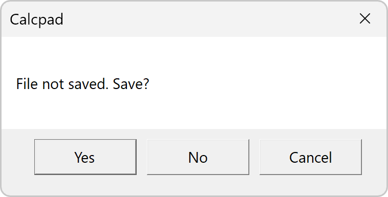

# Working with Files

Input data in CalcpadCE can be saved to disk and reused multiple times.
The supported file formats are "**\*.txt**", "**\*.cpd**" and "**\*.cpdz**". Input forms have to be saved to "**\*.cpd**" and "**\*.cpdz**" files and text scripts to "**\*.txt**" files.
Both "**\*.cpd**" and "**\*.cpdz**" file types are associated with CalcpadCE and can be opened with double click.
The main difference between the two formats is that "**\*.cpd**" is a text file and can be edited while "\***.cpdz**" is binary and can be only executed.
The source code inside is protected from viewing, copying and modification.

## New

You can start a new file by clicking the  button.
This will clear the file name and the source code.
If the current file is not saved, you will be prompted to do that.

If you answer "**Yes**", the "**File Save**" dialog will appear.
Enter file name and click "**Save**". Thus, you will preserve your data before being cleared.
If you select "**Cancel**" you will interrupt the command and everything will remain unchanged.

## Open

You can open an existing file with the  button.
A file selection dialog will appear.
The active file extension is "\*.cpd", by default.
If you search for "\*.txt" or "\*.cpdz" files, select the corresponding type at the bottom of the dialog.
Then find the required file and press "**Open**" or double click on the file.
It will be loaded into CalcpadCE and the file name will be displayed in the title bar.

## Save

You can save the current file by clicking the  button.
If the file has not been saved so far, you will be prompted to select path and name.
Otherwise, it will be rewritten at the current location.

## Save As…

If you need to save the current file with a different name, select the "**File/Save As…**" menu command.
A file selection dialog will be displayed.
Select file path and name and click "**Save**"
