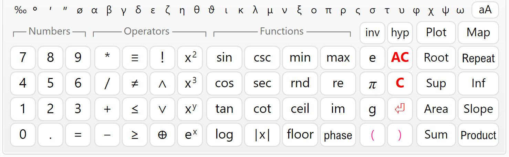
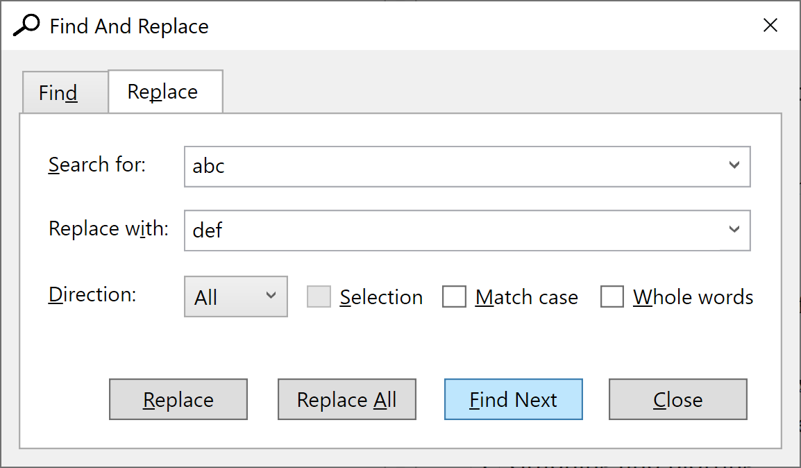

# Writing Math

Enter the math into the "**Code**" input window.
Spacing and indent are maintained automatically.
You can use the computer keyboard or the "**Numeric Keypad**" below.
You can copy text from and to the input window or any external program (e.g. **Word**). There is a toolbar above the input window with some useful editing commands: Copy, Paste, Undo, Redo and Insert Image.

The source code is logically divided into lines, which are numbered automatically.
Each expression should be on a separate line.
By exception, it is possible to have several expressions on the same line, but they must be separated by comments.
When you finish the line, press "**Enter**" to start a new line.
Syntax highlighting is performed automatically.
Different code elements are displayed with different colors depending on their type.
For example, comments are colored green, and errors are colored red.
All comments must be enclosed by quotes.
They can include both plain text and **Html**. You can use Html to add pictures, tables and format the report.

## User Interface

### Numeric Keypad

The numeric keypad is useful when you work on a tablet or laptop with touch screen.
When you press a button, the respective symbols are inserted at the place of the cursor.
The keypad is separated into four sections: "**Numbers**", "**Operators**", "**Functions**" and "**Other**". The "**=**" key does not calculate the answer as on simple calculators.
This is the assignment operator (e.g. "*a* = 4"). If you need to check the equality of two numbers, use the "≡" operator (for example, "*a* ≡ *b*" means: "Is *a* equal to *b*?"). The "**e**", "**π**" and "**g**" keys insert the respective built-in constants *e* ≈ 2.7183, *π* ≈ 3.1416 and *g* ≈ 9.8066.

If you don't need the keypad and want to free some space, you can hide it with the  button.
Click again to show the keypad back.

The "**C**" button deletes the previous symbol and "**AC**" deletes a whole line.
If you double click this button, you will clear the whole text.
If you have done this accidentally, you can use **Undo**  to restore.

### Moving inside the text

Writing and editing text in CalcpadCE is not much different than any other Windows program.
If you have some experience in that, you can skip this and go straight to "**Expressions**".

You can type at arbitrary position inside the text.
The place where symbols are inserted is called "**text cursor**" (the blinking vertical line "**\|**"). You can change the cursor position by clicking with the mouse or using the arrows "← → ↑ ↓" from the keyboard.
Arrows will move the cursor one symbol left or right and one line up or down.
If you hold the "**Ctrl**" key and press an arrow, the cursor will move with a whole word. "**Home**" and "**End**" keys will send you to the beginning or the end of the current line, respectively.
If you hold "**Ctrl**" beforehand, you will go to the beginning or the end of the entire text.

### Selecting text

Most editing commands require you to select some text to which the command will be applied.
The selected text is usually displayed with blue background (it may look different depending on your system settings). You can select text with the mouse as follows: Press the left mouse button at the start position of the text to be selected.
Hold the button and move the mouse to the end position.
Then release the button.
Alternatively, you can click at the start, press **Shift** and then click at the end.
You can also use the computer keyboard.
Hold **Shift** and press arrows or "**Home**", "**End**", "**Page Up**", "**Page Down**".

### Deleting text

You can delete a single symbol by pressing the "**Delete**" ("Del") or "**Backspace**" ("Bkspc") keys.
The difference is that "Delete" removes the symbol after the cursor, and "Backspace" - before the cursor.
If you hold "**Ctrl**" beforehand, you can delete whole words instead of separate symbols.
If you need to delete a larger part of the text, you can select it and press either "Delete" or "Backspace" after that.

### Copy

If some part of the text is repeated, you can copy it instead of typing it again.
That requires two steps: "Copy" and "Paste". At the first step (Copy), the selected text is sent to memory called **Clipboard**. At the second step (Paste), the text is inserted at the new places.
Once copied, you can paste the text at multiple places.

You can copy the selected text to the Clipboard by pressing "**Ctrl+C**" or by clicking the  button.

### Paste

Before you paste a text from the Clipboard you have to position the cursor at the required place.
Then press "**Ctrl+V**" or the  button.
You can copy text from CalcpadCE and paste it to other programs and vice versa.
For example, you can take some formulas from Word, calculate them in CalcpadCE and return the results back to Word.

### Undo

This command undoes the result from the last editing command and restores the previous state.
You can undo up to 10 steps back.
Just press "**Ctrl+Z**" or click the  button.

### Redo

"Redo" performs in the opposite way to "Undo". It restores a command that has been undone.
Redo must follow immediately the last Undo.
If you enter or edit some text meanwhile, you will lose the ability to redo.
Click the  button to redo.

### Find

You can search for a certain text inside the code and replace it with another, if needed.
Select the "**Edit/Find**" menu, click the  button or press "**Ctrl+F**". The "**Find And Replace**" dialog will appear.

Enter a word or phrase to search for and click "**Find Next**". The program starts from the current position and finds the first occurrence in the selected direction.
If the searched phrase is found, it is highlighted, and the search is stopped.
To find the next occurrence, click "**Find Next**" again.
You can also press "**F3**" to continue searching even after you close the dialog.

If you need to replace the searched text, click the "**Replace**" tab and fill in the "**Replace with**" box.
Then click the "**Replace**" button.
The program will replace the current occurrence and will automatically move to the next one.
If you want to replace all occurrences in the code, click the respective button instead.

There are several options that affect the search results, as follows:

- **Direction**: "Up", "Down" and "All". Both "All" and "Down" search towards the end of the document.
The difference is that "All" jumps to the beginning and starts over, after it reaches the end of the document.

- **Selection**: It works only with the "**Replace All**" command.
You need to make the selection first and then to display the "**Find And Replace**" dialog.
Then, if you check the "**Selection**" options, all the replacements will be made only inside the selected text.

- **Match case**: If selected, the search will make difference between capital and small letters.
By default, the case is neglected.

- **Whole words**: If selected, the program will search only for sequences that represent whole words.

## Coding aids

### Syntax highlighting

Syntax highlighting applies different colors to different components of the programming language: functions, variables, operators, etc.
It runs automatically in the background, each time you edit and leave the current line.
All errors are highlighted in red.
The program makes difference between defined and undefined variables and functions.
The color palette is predefined and cannot be changed.
Currently, CalcpadCE does not support custom styles and themes.

### Auto-indentation

The indentation of the separate lines in the code is maintained automatically by the program.
All lines that are inside conditional and loop blocks are indented accordingly.
Additionally, you can add spaces at the beginning of each line.
Although spacing is also handled automatically, the leading spaces are not affected.

### Auto-complete

When you start typing, the program displays a drop-down list with suggestions that match what you have just typed.
It contains keywords, units of measurement, built-in function and all custom variables and functions that are defined above the current line.
The list is dynamically filtered and sorted while you are typing.
The current suggestion in the list is highlighted.
If that is what you need, just press "**Tab**" to insert it at the current position.
Click on the list to insert some of the other suggestions.
Alternatively, you can press "**Down Arrow**" to browse the available suggestions and "**Enter**" to insert the selected one.
If the list is above the current line, press "**Up Arrow**" instead.

### Bracket matching

The program can find the matching opening and closing brackets.
If you position the cursor next or before one of them, both brackets are highlighted.
If there is no corresponding bracket, nothing is highlighted.

### Greek letters

You can insert Greek letters by clicking the respective symbol below the code editor.
Alternatively, type the Latin equivalent from the table below and press "**Ctrl+G**". If you press it again, you will convert the letter back from Greek to Latin.
Since "j"/"J" and "V" remain unused, they are mapped to "ø"/"Ø" and "∡", respectively.

| Name      | greek | latin | Greek | Latin |
|-----------|-------|-------|-------|-------|
| alpha     | α     | a     | Α     | A     |
| beta      | β     | b     | Β     | B     |
| gamma     | γ     | g     | Γ     | G     |
| delta     | δ     | d     | Δ     | D     |
| epsilon   | ε     | e     | Ε     | E     |
| zeta      | ζ     | z     | Ζ     | Z     |
| eta       | η     | h     | Η     | H     |
| theta     | θ     | q     | Θ     | Q     |
| theta-alt | ϑ     | v     | ∡     | V     |
| iota      | ι     | i     | Ι     | I     |
| kappa     | κ     | k     | Κ     | K     |
| lambda    | λ     | l     | Λ     | L     |
| mu        | μ     | m     | Μ     | M     |
| nu        | ν     | n     | Ν     | N     |
| xi        | ξ     | x     | Ξ     | X     |
| omicron   | ο     | o     | Ο     | O     |
| pi        | π     | p     | Π     | P     |
| rho       | ρ     | r     | Ρ     | R     |
| sigma     | σ     | s     | Σ     | S     |
| tau       | τ     | t     | Τ     | T     |
| upsilon   | υ     | u     | Υ     | U     |
| phi       | φ     | f     | Φ     | F     |
| chi       | χ     | c     | Χ     | C     |
| psi       | ψ     | y     | Ψ     | Y     |
| omega     | ω     | w     | Ω     | W     |
| phi-diam  | ø     | j     | Ø     | J     |

### Using Notepad++

**Notepad++** is a popular text/code editor.
It is free and open source and can be downloaded from the official website [https://notepad-plus-plus.org](https://notepad-plus-plus.org/). It supports many programming or scripting languages.
Its text editing capabilities are much more powerful than CalcpadCE.
It is also very useful for writing Html code. **CalcpadCE** syntax can be also used with Notepad++. It is predefined as an XML file that can be inserted in Notepad++. You can do this by selecting the "**Language**" menu, then click "**Define your language**" and then, "**Import…**". Find the **CalcpadCE** folder inside your **Program Files** directory or wherever CalcpadCE is installed and select the file named [Calcpad-syntax-for-Notepad++.xml](https://github.com/imartincei/CalcpadCE/tree/main/Setup/Syntax-for-external-editors/Notepad%2B%2B).
